# Camera Adapter — Requirements and Design

> **Status:** Proposed for full review  
> **Version:** 0.2  
> **Date:** 2026-07-10  
> **Component:** `camera-adapter`  
> **Full name:** `com.mbreissi.edgecommons.CameraAdapter`  
> **Category:** adapter (southbound; registry entry uses `category: "adapter"` with a `protocol` field, e.g. `"genicam/onvif"`)  
> **Recommended language:** Rust  
> **Platforms:** HOST, GREENGRASS, KUBERNETES

This document defines the complete intended contract for an EdgeCommons camera adapter. It is a
review artifact and an implementation specification. Nothing in this document is implemented merely
because the repository and this document exist.

This is an internal design document. Following the component convention, it lives at the repository
root as `DESIGN.md`, outside the Diátaxis `docs/` tree that syncs to the public docs site, and is
never published there.

The adapter connects to many industrial cameras, captures still images on schedules or through
commands, writes completed files to a configurable local root, publishes capture metadata on the
device-local EdgeCommons bus, and exposes camera and PTZ control through the standard command inbox.

The design deliberately covers two major standards families in one component:

- machine-vision cameras through a **GenICam/Aravis** backend, initially GigE Vision and USB3 Vision;
- network video cameras through an **ONVIF/RTSP** backend, including ONVIF PTZ where the device reports
  that capability.

The component has one runtime, one configuration model, one command and published-message contract, and multiple
backend implementations. ONVIF/RTSP is not a separate EdgeCommons component.

---

## 1. Goals and success criteria

The design is successful when an implementation can demonstrate all of the following:

1. Connect to at least 256 configured cameras in one process without allocating an image-sized buffer
   per idle camera.
2. Execute captures concurrently within configurable camera, backend, resource-group, memory, and disk
   limits.
3. Capture from GenICam cameras and ONVIF cameras, with RTSP frame extraction when an ONVIF snapshot is
   unavailable or explicitly not desired.
4. Trigger capture through an optional schedule, a terminal request/reply command, or an asynchronous
   submitted command.
5. Persist a complete, verified image before reporting success.
6. Publish enough metadata for a local consumer to find and validate the image, including both its
   absolute and output-root-relative paths.
7. Preserve request correlation in direct replies and command-originated terminal messages.
8. Offer a complete camera control surface, including capability-gated pan, tilt, zoom, home, status,
   and preset operations.
9. Continue operating healthy cameras when another camera is offline, misconfigured, or slow.
10. Run under the EdgeCommons HOST, GREENGRASS, and KUBERNETES platform profiles without branching the
    business logic by platform.
11. Validate behavior with deterministic in-process simulation, protocol simulators, real messaging
    transports, and representative physical cameras.

## 2. Scope

### 2.1 Included

- Still-image capture from configured cameras.
- Per-camera optional schedules; no schedule means command-only operation.
- Multiple named capture profiles per camera.
- Software-level multi-camera group capture (`sb/capture-group`), with per-camera jobs joined by a
  shared group identifier.
- GenICam discovery, feature configuration, software trigger, buffer acquisition, and metadata.
- ONVIF capability discovery, media profiles, snapshot URI capture, authentication, and PTZ.
- RTSP frame extraction as an ONVIF backend capture mode and fallback.
- Durable capture-job state, idempotent submission, cancellation, status recovery, and message outbox.
- Crash-recoverable local file persistence under one configured output root.
- Optional local metadata sidecars.
- Commands, events, health, metrics, logging, credentials, config reload, and shutdown.
- Native packaging and deployment requirements for HOST, Greengrass, and Kubernetes.

### 2.2 Excluded from the initial implementation

- Continuous video recording, video analytics, object detection, and image inference.
- Transporting image bytes through MQTT or Greengrass IPC.
- Cloud or remote file delivery; `file-replicator` owns that concern.
- Hardware-synchronized, sub-frame multi-camera acquisition. Hardware-trigger support can be added to
  the GenICam backend later, but v1 scheduling and group capture do not claim physical
  synchronization.
- Camera firmware updates and arbitrary vendor feature editing.
- Multi-active adapter replicas controlling the same cameras.
- Automatic deletion or retention of completed images. Retention belongs to an operator policy or a
  downstream file component.
- Silent fallback from an explicitly requested capture mode or image encoding.

## 3. Normative language and terminology

The words **MUST**, **MUST NOT**, **SHOULD**, **SHOULD NOT**, and **MAY** are normative.

| Term | Meaning |
|---|---|
| Camera instance | One `component.instances[]` entry and one EdgeCommons instance identity. |
| Backend | A protocol implementation such as `genicam-aravis` or `onvif-rtsp`. |
| Capture profile | Named acquisition and output settings resolved when a job is accepted. |
| Capture job | Durable work identified by `captureId`, from acceptance through a terminal state. |
| Direct capture | `sb/capture`; one request receives one terminal reply. |
| Submitted capture | `sb/capture-submit`; one request receives an immediate acceptance reply and observes completion through terminal messages or status. |
| Source frame | Bytes and metadata acquired from the camera before optional conversion. |
| Final image | The installed file visible to consumers. |
| Resource group | A configurable admission-control group, normally a NIC, USB controller, or storage path. |
| PTZ | Pan, tilt, and zoom control exposed only when enabled and supported. |
| Terminal state | `SUCCEEDED`, `FAILED`, `CANCELLED`, or `INTERRUPTED`. |

## 4. Architectural decisions

| ID | Decision | Resolution | Rationale |
|---|---|---|---|
| D-CAM-1 | Component boundary | One `camera-adapter` with pluggable backends | Consumers should not need different components or message contracts for machine-vision and ONVIF cameras. |
| D-CAM-2 | Language | Rust | Bounded memory, actor-style concurrency, native-library interop, and consistency with other high-throughput EdgeCommons components. |
| D-CAM-3 | Camera identity | One camera per `component.instances[]` entry | Matches the current southbound adapter convention and stamps published messages with the camera instance. |
| D-CAM-4 | Output location | One absolute `rootDirectory`; each camera gets a subdirectory by default | Removes the unexplained storage identifier and prevents ordinary filename collisions. |
| D-CAM-5 | Scheduled operation | `schedules[]` is optional per camera | Omitting schedules creates a command-only camera. |
| D-CAM-6 | Successful capture | Final file is installed and flushed before success is recorded | A success message must never point at a partial file. |
| D-CAM-7 | Paths in metadata | Publish `absolutePath`, `relativePath`, and `fileUri` | Local consumers may not know the publisher's output root; relative paths remain portable. |
| D-CAM-8 | Image bytes | Never publish image bytes on the bus | Files are the data plane; the bus carries control and metadata. |
| D-CAM-9 | Capture messaging | Support terminal and submitted capture commands | Direct consumers can await completion; asynchronous workflows can avoid long request deadlines. |
| D-CAM-10 | Long-running reply | Add deferred command replies to EdgeCommons core in all four languages | The current command inbox auto-replies and explicitly requires fast handlers; bypassing it would split the command model. |
| D-CAM-11 | Domain-message correlation | Add a correlation-aware `app()` builder/view in all four languages | Command-originated terminal metadata must carry the original correlation ID while still using the application-message facade. |
| D-CAM-12 | Message classes | Publish terminal image metadata on `app/image/*`; use `events()` for operator lifecycle and alarms | `app` is the current free-form inter-component class; `evt` has a standardized operator-event body and severity/type channel. |
| D-CAM-13 | Durable status | SQLite job catalog plus durable message outbox | Recovers status after request timeout or restart and supports at-least-once terminal metadata publication. |
| D-CAM-14 | ONVIF capture | Prefer configured ONVIF snapshot mode; support RTSP frame mode and fallback | Snapshot is efficient; RTSP is needed when snapshot support or freshness is inadequate. |
| D-CAM-15 | PTZ | Common normalized command contract mapped through backend capabilities | ONVIF provides the initial PTZ implementation; unsupported backends return a capability error. |
| D-CAM-16 | Fleet safety | Layered bounded queues and byte-based admission | Camera count alone is not a safe memory or bandwidth bound. |
| D-CAM-17 | Delivery | Integrate with `file-replicator` through disk and metadata, not code coupling | Keeps acquisition and delivery independently deployable. |
| D-CAM-18 | Command addressing | Use the shipped component `main` inbox and select camera `instance` in the body | Matches the shipped CommandInbox contract and both shipped adapters. This deliberately proposes to supersede the approved-but-unshipped Phase 5 per-instance `cmd/sb/*` addressing in `core/docs/SOUTHBOUND.md` §2.2; accepting or rejecting that renegotiation is an explicit review decision (§27). |
| D-CAM-19 | Outbox acknowledgement | Add acknowledgement-capable QoS 1 publish before claiming message delivery | Current publish submission is not sufficient evidence of MQTT PUBACK; a crash must leave ambiguous messages pending. |
| D-CAM-20 | Group capture | `sb/capture-group` fans one request out as independent per-camera capture jobs sharing an adapter-generated `captureGroupId`; the single deferred reply aggregates every member's terminal result | One operator action often needs an evidence set from several cameras. Aggregation fits the shipped single-reply command model plus the D-CAM-10 deferred reply; a core scatter-gather exchange (one request, multiple replies) is not required for v1 and is raised as a core question (§27). |

## 5. System context

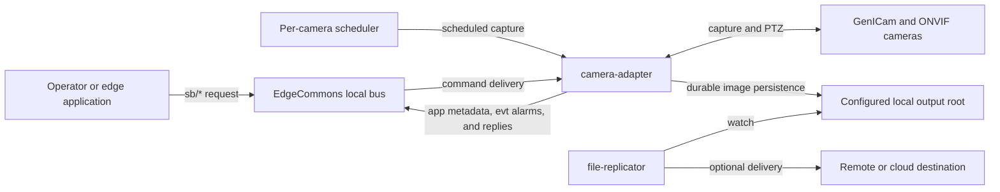

The image file is the primary data product. A message announces the product and describes where it was
written; it is not a replacement for the file.

## 6. Component architecture

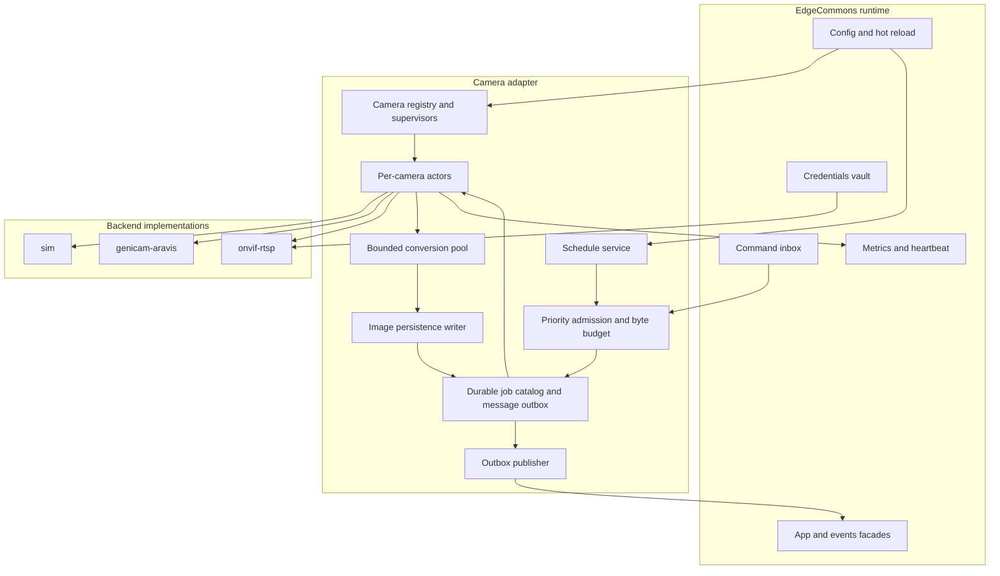

### 6.1 Runtime responsibilities

- **Camera registry:** owns the configured camera roster, validates unique IDs and selectors, starts one
  lightweight supervisor per enabled camera, and provides immutable capability snapshots.
- **Camera supervisor:** maintains connection state with capped exponential backoff and jitter. It does
  not allocate full frame buffers while idle.
- **Camera actor:** serializes operations that the physical device or backend cannot safely perform in
  parallel. It owns the backend session and separate bounded control and capture mailboxes.
- **Schedule service:** evaluates cron expressions with an injected clock, applies misfire and overlap
  policy, and submits normal capture jobs.
- **Admission controller:** applies priority, per-camera queue bounds, global concurrent-capture limits,
  per-resource-group limits, encoder limits, and a byte budget.
- **Job catalog:** durably records job parameters, effective profile, state, paths, results, errors,
  idempotency keys, and terminal-message delivery state.
- **Encoder pool:** performs CPU-heavy pixel conversion outside async executor threads.
- **Image persistence writer:** validates paths, writes and flushes a same-directory partial file, then
  finalizes it under the platform-specific guarantees in §9.2 and returns checksum and final metadata.
- **Outbox publisher:** retries terminal `app` messages until the messaging service confirms publication.

### 6.2 Backend abstraction

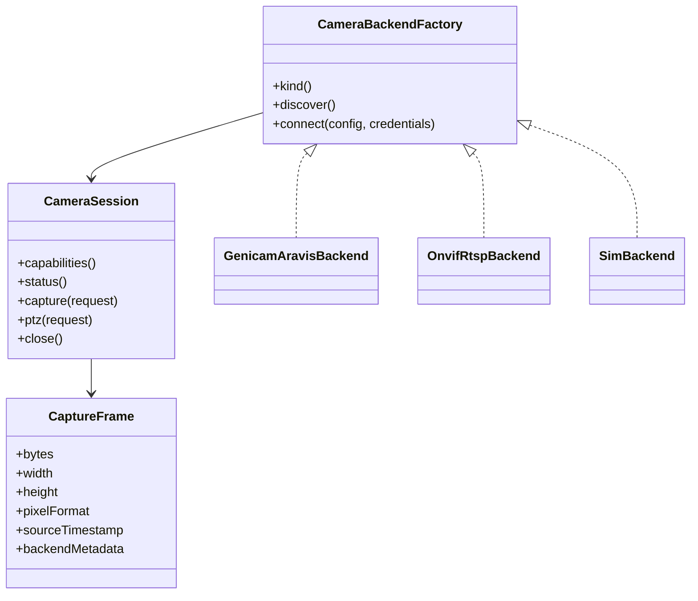

The production interface MUST be mockable without a native camera library. The in-process `sim` backend
is a required implementation, not only a test fixture hidden behind conditional compilation.

### 6.3 Threading and blocking I/O

- Tokio tasks MAY manage camera state, timers, queues, messaging, HTTP, and durable outbox work.
- Native GenICam calls, blocking SDK callbacks, image conversion, and filesystem flush operations MUST
  run on dedicated bounded workers or explicitly bounded blocking tasks.
- No unbounded `spawn_blocking`, thread-per-request, or frame-per-camera preallocation is allowed.
- A backend MAY own a dedicated native thread when its SDK requires thread affinity, but the total must
  be observable and bounded by configured connected cameras.

## 7. Camera lifecycle

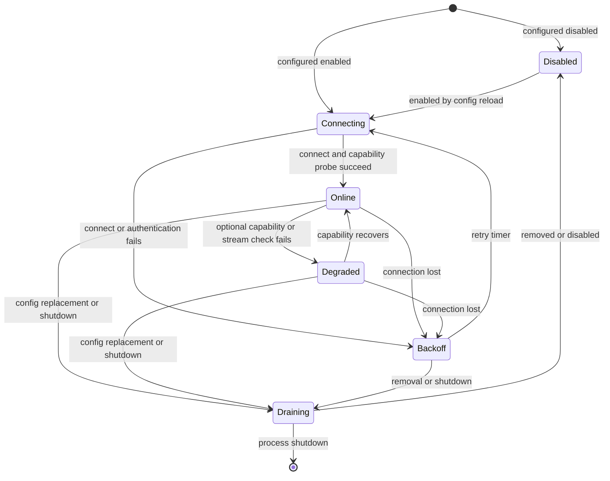

The component MUST remain ready when one camera is offline. Camera health is reported per instance.
Readiness becomes false only when the runtime cannot accept commands safely, configuration has no valid
enabled camera instances, the job catalog is unavailable, or the output root cannot be used.

Connection behavior:

- Backoff starts at 1 second, doubles to a configurable maximum of 60 seconds, and adds jitter.
- Authentication and permanent configuration errors use a slower retry class and a distinct error code.
- Disconnect raises a stateful `camera-disconnected` alarm. Reconnection clears the same alarm type.
- Capability discovery runs after every new session and when the backend reports a capability change.
- A camera never binds implicitly to "the first discovered device." Production binding requires a stable
  configured selector such as serial number, MAC address, endpoint, or ONVIF device service URL.

## 8. Capture job model

### 8.1 State machine

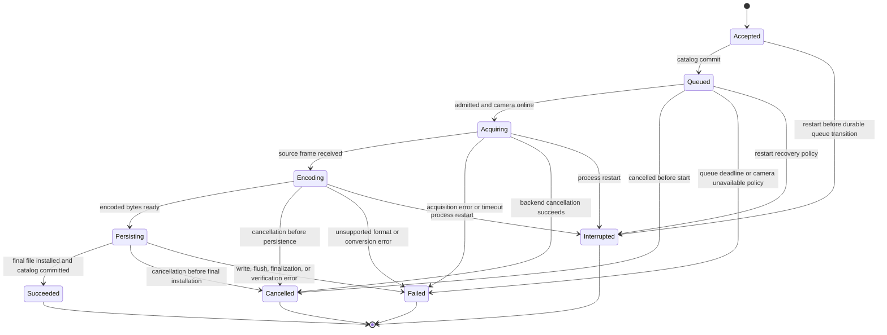

The public state names are:

`ACCEPTED`, `QUEUED`, `ACQUIRING`, `ENCODING`, `PERSISTING`, `SUCCEEDED`, `FAILED`, `CANCELLED`, and
`INTERRUPTED`.

### 8.2 Identifiers and idempotency

- `captureId` is an opaque, globally unique, time-sortable identifier generated by the adapter.
- `sb/capture` and `sb/capture-submit` MUST include `requestId`. It is a caller-generated application
  idempotency key, not a messaging correlation ID. Requiring it guarantees that a caller can recover a
  job after timing out before it learns the adapter-generated `captureId`.
- The uniqueness scope is `(camera instance, requestId)` for the configured result-retention period.
- Repeating an identical request returns the existing `captureId` and current or terminal result.
- Reusing a `requestId` with different effective parameters returns `IDEMPOTENCY_CONFLICT`.
- A retried direct capture MAY attach another deferred waiter to the same in-progress job. All attached
  waiters receive the same terminal result; their reply envelopes preserve their own correlation IDs.
- The job records `originCorrelationId` only from the request that first created it. Retries and attached
  waiters never replace that value. The single terminal application message carries this creating
  correlation; consumers join terminal messages by `captureId`, not by requiring their retry's
  correlation to match.
- Scheduled jobs use `(camera instance, scheduleId, intendedFireTime)` as their deduplication key so a
  restart cannot double-fire the same schedule occurrence.
- A group capture spans instances, so its uniqueness scope is the component-scoped key
  `(main, sb/capture-group, requestId)`. Member jobs record `trigger.type = "group-command"`, the
  group `requestId`, and the shared `captureGroupId` while keeping their own member `captureId`.

#### 8.2.1 Idempotency for every mutating command

The durable command ledger keys every mutating operation by `(instance, verb, requestId)`. It stores a
canonical hash of immutable arguments, creation time, operation state, and the reply result/error for the
same retention window as capture status.

- An exact duplicate returns the stored result or the existing in-progress operation and never repeats
  the physical action.
- Different arguments under the same key return `IDEMPOTENCY_CONFLICT`.
- Capture commands map the ledger entry to their durable capture job. A group capture maps its single
  component-scoped ledger entry to every member job.
- Reconnect, cancel, PTZ move/stop/home, and preset goto/set/remove create a ledger entry before calling
  the backend and persist the result after it returns. Reconnect persists its result as soon as the
  session cancellation is signalled: it performs no physical actuation, and the new session is the
  supervisor's own reconnect loop.
- A crash after physical actuation but before result commit marks the ledger entry `OUTCOME_UNKNOWN`.
  A retry returns `PREVIOUS_OUTCOME_UNKNOWN` and does not automatically repeat potentially hazardous PTZ
  or preset work. Startup still sends best-effort PTZ stop for continuous motion.
- Reconnect is excluded from that fence. It is idempotent and safe to redo, and a restart re-establishes
  every session by definition, so startup settles an interrupted reconnect ledger as `SUCCEEDED` before
  the fence runs. An unsettled reconnect row would be immortal: no retention statement deletes an
  `IN_PROGRESS` or `OUTCOME_UNKNOWN` operation.
- Read-only `sb/list`, `sb/discover`, `sb/status`, PTZ status, and preset list do not require `requestId`
  and are not recorded.

Count pruning shares `state.maxResultRecords` but never removes an in-progress or `OUTCOME_UNKNOWN`
operation without an explicit operator acknowledgement policy in a later design.

### 8.3 Admission priority

From highest to lowest:

1. PTZ `stop` and component shutdown safety operations.
2. Other PTZ operations.
3. Direct `sb/capture` jobs.
4. Submitted `sb/capture-submit` jobs.
5. Scheduled jobs.

Group-capture members inherit the priority of their originating verb: `sb/capture-group` members rank
with direct captures and `sb/capture-group-submit` members rank with submitted captures.

Priority affects admission, not forced cancellation of a frame already being acquired. Aging MUST
prevent indefinite starvation of scheduled jobs.

### 8.4 Cancellation

- A queued job is cancelled synchronously.
- Acquisition cancellation is best effort and backend-specific.
- Encoding and persistence cancellation is allowed only before final installation starts.
- A final file is never deleted by `sb/capture-cancel`.
- A deferred direct requester receives a terminal `CAPTURE_CANCELLED` error when another consumer
  successfully cancels its job.

## 9. Storage and file contract

### 9.1 Effective path

`component.global.output.rootDirectory` MUST be an absolute path. The default layout below is applied
unless `cameraDirectoryTemplate` or `fileNameTemplate` is overridden:

```text
{rootDirectory}/{cameraId}/{yyyy}/{MM}/{dd}/{timestamp}-{captureId}.{extension}
```

Each camera therefore receives its own subdirectory under the single output root. Templates may use
only documented variables. Rendered paths MUST be relative, MUST NOT contain `..`, and MUST resolve
under the canonical output root. Camera IDs and other path variables are sanitized before rendering.
Linux enforces this at every filesystem operation with handle-relative no-follow traversal. Windows uses
the accepted portable-persistence profile in §9.2 and does not guarantee containment against a hostile
concurrent local junction/reparse or directory-rename actor after validation.

### 9.2 Platform-specific finalization

```mermaid
flowchart LR
  Frame["Captured frame"] --> Convert["Optional conversion"]
  Convert --> Temp["Exclusive same-directory .partial file"]
  Temp --> Flush["Write, checksum, and flush"]
  Flush --> Record["Catalog records PERSISTING target"]
  Record --> Rename["Final install (Linux atomic; Windows no-overwrite link)"]
  Rename --> Verify["Verify size and final path"]
  Verify --> Commit["Catalog SUCCEEDED plus message outbox"]
```

The writer MUST:

1. Create parent directories safely.
2. Create the partial file exclusively in the final directory.
3. Stream bytes through a SHA-256 calculation.
4. Flush file content to the operating system and request durable storage where supported.
5. Record the intended final path while the job is `PERSISTING`.
6. Install the final file within the same filesystem. Linux uses atomic no-replace installation; Windows
   uses standard-library no-overwrite link/install followed by partial cleanup and reports a collision,
   unsupported hard-link filesystem, or finalization failure as `PERSISTENCE_FAILED`.
7. Flush the parent directory where the platform supports it.
8. Commit terminal metadata and an outbox message transactionally in SQLite.

A crash after finalization but before terminal catalog commit is recovered by inspecting the `PERSISTING`
record and verifying the final file. A partial file without a valid final image is removed during
recovery and the job becomes `INTERRUPTED` or `FAILED` according to recovery policy.

### 9.3 Metadata paths

Every successful result and `ImageCaptured` application message includes:

- `absolutePath`: native absolute path on the publisher;
- `relativePath`: path relative to `rootDirectory`, always using `/` separators on the wire;
- `fileUri`: escaped `file:` URI for the absolute path.

An absolute path is only directly actionable by a consumer sharing the publisher's filesystem. A remote
consumer must use file-replicator delivery metadata or another shared storage mapping. Because absolute
paths disclose host layout, deployments that bridge application messages northbound SHOULD filter or
redact the field at the bridge policy layer; the local message remains complete.

### 9.4 Output encodings

Initial supported output modes:

| Output | Source requirements | Behavior |
|---|---|---|
| `passthrough` | Source already has a declared file encoding, initially ONVIF JPEG | Preserve source bytes and content type. |
| `jpeg` | Decodable mono, RGB, BGR, or RTSP frame | Encode with configured quality. |
| `png` | Decodable mono, RGB, or BGR | Lossless output. |
| `tiff` | Supported decoded pixel format | Lossless industrial-image output with frame metadata where supported. |
| `raw` | Any bounded source frame | Preserve bytes; metadata is required to interpret pixel format and dimensions. |

Unsupported pixel formats MUST fail with `UNSUPPORTED_PIXEL_FORMAT`; the adapter MUST NOT silently write
mislabelled bytes. Bayer demosaicing and additional PFNC formats are added explicitly with compatibility
tests.

### 9.5 Storage pressure

- A configurable minimum-free-bytes and minimum-free-percent check runs before capture admission and
  before persistence.
- Low space raises a deduplicated `storage-low` alarm and returns `STORAGE_PRESSURE` for new jobs.
- Existing writes may finish if their reserved byte budget remains valid.
- The same floors monitor the `state.directory` filesystem. A catalog or outbox write that fails for
  lack of space raises the stateful `storage-low` alarm with the state root in context, and readiness
  becomes false while the job catalog cannot commit (§19.4), because the catalog is the component's
  source of truth.
- The adapter does not delete completed images to recover space.

### 9.6 Optional metadata sidecar

When `writeMetadataSidecar` is true, the adapter writes `<image-name>.json` containing the terminal
application-message body without its EdgeCommons envelope. The sidecar uses its own same-directory
partial file and the same platform-specific finalization profile. The job remains `PERSISTING` until both image and sidecar are durable;
`ImageCaptured` is not published earlier. Restart reconciliation completes or fails the sidecar from the
durable job record. A final image left visible by a crash before sidecar completion is an unannounced
orphan until reconciliation and MUST NOT be treated as a successful capture merely because it exists.

## 10. Configuration model

Camera-specific configuration belongs under permissive `component.global` and
`component.instances[]`. No new top-level schema section is required.

### 10.1 Full configuration example

```jsonc
{
  "component": {
    "token": "camera-adapter",
    "global": {
      "output": {
        "rootDirectory": "/var/lib/edgecommons/captures",
        "cameraDirectoryTemplate": "{cameraId}/{yyyy}/{MM}/{dd}",
        "fileNameTemplate": "{timestamp}-{captureId}.{extension}",
        "writeMetadataSidecar": false,
        "minimumFreeBytes": 1073741824,
        "minimumFreePercent": 5
      },
      "state": {
        "directory": "/var/lib/edgecommons/camera-adapter-state",
        "resultRetentionHours": 72,
        "maxResultRecords": 100000,
        "outboxRetentionHours": 168,
        "queuedRecoveryPolicy": "requeue"
      },
      "limits": {
        "maxConnectedCameras": 256,
        "maxConcurrentCaptures": 32,
        "maxConcurrentEncodes": 8,
        "maxConcurrentWrites": 8,
        "maxConcurrentConnects": 16,
        "maxInFlightBytes": 1073741824,
        "maxFrameBytesPerCamera": 268435456,
        "maxMetadataBytes": 8192,
        "maxQueuedCapturesPerCamera": 4,
        "maxDeferredWaitersPerCapture": 8,
        "maxCamerasPerGroup": 32,
        "resourceGroups": {
          "vision-nic-1": { "maxConcurrentCaptures": 8 },
          "usb-controller-1": { "maxConcurrentCaptures": 4 }
        }
      },
      "timeouts": {
        "connectMs": 10000,
        "reconnectBackoffMinMs": 1000,
        "reconnectBackoffMaxMs": 60000,
        "jobTerminalMs": 90000,
        "captureMs": 30000,
        "encodeMs": 30000,
        "persistMs": 30000,
        "ptzMs": 10000,
        "replyMarginMs": 5000,
        "maxDeferredReplyLifetimeMs": 95000,
        "reloadDrainTimeoutMs": 30000,
        "shutdownGraceMs": 30000
      },
      "discovery": {
        "enabled": true,
        "reportUnconfigured": false,
        "intervalSeconds": 60
      },
      "operatorEvents": {
        "captureLifecycle": false
      },
      "healthThresholds": {
        "staleSignalSecs": 300
      }
    },
    "instances": [
      {
        "id": "filler-west",
        "enabled": true,
        "resourceGroup": "vision-nic-1",
        "backend": {
          "type": "genicam-aravis",
          "selector": { "serial": "12345678" },
          "transport": "gige-vision",
          "packetSize": "auto"
        },
        "defaultCaptureProfile": "inspection",
        "captureProfiles": {
          "inspection": {
            "captureMode": "software-trigger",
            "offlinePolicy": "waitUntilDeadline",
            "pixelFormat": "Mono8",
            "exposureMicros": 4000,
            "gain": 1.0,
            "output": { "encoding": "png" }
          }
        },
        "schedules": [
          {
            "id": "hourly",
            "enabled": true,
            "cron": "0 0 * * * *",
            "timezone": "America/Chicago",
            "captureProfile": "inspection",
            "misfirePolicy": "skip",
            "overlapPolicy": "skip",
            "jitterSeconds": 0
          }
        ]
      },
      {
        "id": "yard-ptz-01",
        "enabled": true,
        "resourceGroup": "vision-nic-1",
        "backend": {
          "type": "onvif-rtsp",
          "deviceServiceUrl": "https://10.0.8.25/onvif/device_service",
          "credentials": { "$secret": "cameras/yard-ptz-01" },
          "mediaProfile": "main",
          "captureMode": "snapshot-uri",
          "rtspFallback": true,
          "allowInsecure": false,
          "allowedUriHosts": ["10.0.8.25"],
          "maxSoapBytes": 1048576,
          "maxSnapshotBytes": 67108864,
          "tls": { "ca": { "$secret": "cameras/site-ca" }, "verifyHostname": true }
        },
        "defaultCaptureProfile": "main",
        "captureProfiles": {
          "main": {
            "output": { "encoding": "passthrough" }
          }
        },
        "ptz": {
          "enabled": true,
          "maximumContinuousMoveMs": 10000,
          "captureInterlock": "reject",
          "settleMs": 750,
          "allowPresetMutation": false
        }
      }
    ]
  },
  "messaging": { "requestTimeoutSeconds": 100 },
  "heartbeat": { "enabled": true, "intervalSecs": 5, "destination": "local" }
}
```

The second camera has no `schedules` field and is therefore command-only.

### 10.2 Global output

| Field | Required | Default | Meaning |
|---|---|---|---|
| `rootDirectory` | yes | — | Absolute root for every final image. |
| `cameraDirectoryTemplate` | no | `{cameraId}/{yyyy}/{MM}/{dd}` | Relative directory layout. |
| `fileNameTemplate` | no | `{timestamp}-{captureId}.{extension}` | Collision-resistant filename. |
| `writeMetadataSidecar` | no | `false` | Require a durable `<image>.json` beside the image before terminal success. |
| `minimumFreeBytes` | no | `1 GiB` | Refuse new work below this free-space floor. |
| `minimumFreePercent` | no | `5` | Additional percentage floor. |

Output fields reload live for newly accepted jobs. Existing jobs retain their snapshotted root and
templates, and retained status continues to report the path used at capture time.

### 10.3 Camera instance

Each instance MUST have a unique `id`, `backend`, and at least one capture profile. `schedules` is optional.
`enabled` defaults to true. The effective profile is snapshotted into the durable job at acceptance so a
later config reload cannot change an in-flight capture.

### 10.4 Scheduling

| Field | Required | Default/range | Reload |
|---|---|---|---|
| `id` | yes | unique per camera; stable token | live with occurrence dedup preserved |
| `enabled` | no | `true` | live |
| `cron` | yes | six-field expression | live; next occurrence recalculated |
| `timezone` | yes | IANA time-zone identifier | live |
| `captureProfile` | yes | existing profile key | live for future occurrences |
| `misfirePolicy` | no | `skip`; `skip` or `coalesce` | live |
| `overlapPolicy` | no | `skip`; `skip` or `queue` | live |
| `jitterSeconds` | no | `0`; 0–3600 | live; stable per occurrence |

- Cron expressions use the documented six-field syntax, including seconds.
- Time zones use IANA identifiers.
- `misfirePolicy` is `skip` or `coalesce`; `skip` is default. Unbounded catch-up is not supported.
- `overlapPolicy` is `skip` or `queue`; `skip` is default.
- `jitterSeconds` defaults to zero because some industrial use cases care about intended capture time.
  Operators SHOULD add jitter to large fleets when exact alignment is unnecessary.
- A schedule records both `intendedFireTime` and actual admission/acquisition timestamps.

### 10.5 Configuration validation

Startup fails when no enabled, valid camera instance remains. One invalid instance is reported and skipped
only when at least one valid instance can operate, matching the established adapter pattern. The effective
config publisher exposes the redacted configuration; credentials are never expanded into it.

Although the core schema intentionally permits component-specific fields, the camera adapter's own
deserializer rejects unknown fields and the ranges below. `reload` states whether the field can be applied
without replacing camera sessions.

### 10.6 Durable state

| Field | Required | Default/range | Reload |
|---|---|---|---|
| `state.directory` | no | platform durable-data directory; absolute path | restart required |
| `state.resultRetentionHours` | no | `72`; 1–8760 | live; affects future pruning |
| `state.maxResultRecords` | no | `100000`; 1,000–10,000,000 | live; terminal records only |
| `state.outboxRetentionHours` | no | `168`; not shorter than result retention | live; delivered messages only |
| `state.queuedRecoveryPolicy` | no | `requeue`; `requeue` or `interrupt` | applies at next recovery |

### 10.7 Capacity limits and timeouts

| Field | Default/range | Meaning | Reload |
|---|---|---|---|
| `limits.maxConnectedCameras` | `256`; 1–4096 | Maximum enabled supervisors/sessions. | increase live; decrease drains excess by config order |
| `limits.maxConcurrentCaptures` | `32`; 1–256 | Global acquisition permits. | live for new admission |
| `limits.maxConcurrentEncodes` | CPU count capped at 8; 1–64 | CPU conversion permits. | live |
| `limits.maxConcurrentWrites` | `8`; 1–64 | Simultaneous persistence writers. | live |
| `limits.maxConcurrentConnects` | `16`; 1–256 | Reconnect-storm bound. | live |
| `limits.maxInFlightBytes` | `1 GiB`; 64 MiB–host safe limit | Total raw/encoded frame reservation. | live for new admission |
| `limits.maxFrameBytesPerCamera` | `256 MiB`; 1 MiB–2 GiB | Reservation and hard decoded-frame ceiling unless profile is lower. | live for new jobs |
| `limits.maxMetadataBytes` | `8192`; 0–65536 | Maximum encoded caller metadata object. | live for new jobs |
| `limits.maxQueuedCapturesPerCamera` | `4`; 1–1000 | Descriptor queue; no frame bytes. | live; existing jobs are not dropped |
| `limits.maxDeferredWaitersPerCapture` | `8`; 1–64 | Idempotent direct-request waiters. | live |
| `limits.maxCamerasPerGroup` | `32`; 2–256 | Group-capture fan-out bound. | live for new groups |
| `limits.resourceGroups.<name>.maxConcurrentCaptures` | required per named group; 1–global max | Shared NIC/USB/storage admission. | live for new admission |
| `timeouts.connectMs` | `10000`; 100–300000 | One connection attempt. | new/retried connection |
| `timeouts.reconnectBackoffMinMs` | `1000`; 100–60000 | First reconnect delay before jitter. | next retry |
| `timeouts.reconnectBackoffMaxMs` | `60000`; min–3600000 | Capped reconnect delay. | next retry |
| `timeouts.jobTerminalMs` | `90000`; 1000–1800000 | Overall acceptance-to-terminal deadline including queue and every stage. | new jobs |
| `timeouts.captureMs` | `30000`; 100–600000 | Default job acquisition deadline. | new jobs |
| `timeouts.encodeMs` | `30000`; 100–600000 | Conversion deadline. | new jobs |
| `timeouts.persistMs` | `30000`; 100–600000 | Persistence deadline. | new jobs |
| `timeouts.ptzMs` | `10000`; 100–60000 | PTZ protocol response deadline. | new operations |
| `timeouts.replyMarginMs` | `5000`; 100–60000 | Reply settlement margin after terminal job deadline. | new deferred requests |
| `timeouts.maxDeferredReplyLifetimeMs` | `95000`; job terminal deadline plus reply margin, max 1860000 | Inbox deferred-token expiration. | new deferred requests |
| `timeouts.reloadDrainTimeoutMs` | `30000`; 0–600000 | Session replacement drain. | applies to next reload |
| `timeouts.shutdownGraceMs` | `30000`; 0–600000 | Component shutdown budget. | applies to next shutdown |

The configuration validator requires
`maxDeferredReplyLifetimeMs >= max(effective profile timeoutMs or jobTerminalMs) + replyMarginMs` and
rejects a byte limit smaller than any enabled profile's maximum frame reservation. Stage timeouts cap
individual work but never extend the overall job terminal deadline.

### 10.8 Discovery and operator events

| Field | Default | Meaning | Reload |
|---|---|---|---|
| `discovery.enabled` | `false` | Allow bounded periodic and `sb/discover` protocol discovery. | live |
| `discovery.reportUnconfigured` | `false` | Include unconfigured candidates in list/status. | live |
| `discovery.intervalSeconds` | `60`; 5–3600 | Periodic discovery cadence. | live |
| `discovery.maxResults` | `1000`; 1–10000 | Hard discovery roster bound. | live |
| `operatorEvents.captureLifecycle` | `false` | Emit diagnostic queued/started `evt` messages. | live |

### 10.9 Common camera instance

| Field | Required | Default/range | Reload |
|---|---|---|---|
| `id` | yes | stable UNS token; unique | replacement; retained jobs keep old ID |
| `enabled` | no | `true` | drains or starts supervisor |
| `resourceGroup` | no | none | new jobs after active job drains |
| `backend.type` | yes | `genicam-aravis` or `onvif-rtsp` | session replacement |
| `defaultCaptureProfile` | yes | key in `captureProfiles` | live for new jobs |
| `captureProfiles` | yes | non-empty map; at most 100 | live for new jobs |
| `schedules` | no | empty; at most 100 | live; occurrence dedup preserved |
| `ptz` | no | disabled | live where capability permits; active motion is stopped when disabled |

### 10.10 Capture profile

| Field | Required | Default/range | Meaning |
|---|---|---|---|
| `captureMode` | no | backend default | `software-trigger`, `snapshot-uri`, or `rtsp-frame` as supported. |
| `offlinePolicy` | no | direct `waitUntilDeadline`; schedule `failFast` | `failFast`, `waitUntilDeadline`, or `queue`. |
| `queueExpiryMs` | when policy `queue` | 100–86400000 | Maximum offline queue residence. |
| `timeoutMs` | no | global `jobTerminalMs`; 1000–1800000 | Overall acceptance-to-terminal deadline; stage caps still apply. |
| `maximumFrameBytes` | no | global per-camera maximum | Hard compressed/raw/decoded frame limit and reservation. |
| `pixelFormat` | GenICam when fixed | camera negotiated default | Required source pixel format or explicit `auto`. |
| `width`, `height`, `offsetX`, `offsetY` | no | camera/profile default | GenICam region; validated against increments/bounds. |
| `exposureMicros`, `gain` | no | camera/profile default | Applied only when present and writable. |
| `output.encoding` | yes | — | `passthrough`, `jpeg`, `png`, `tiff`, or `raw`. |
| `output.jpegQuality` | for JPEG override | `90`; 1–100 | Encoder quality; ignored only for passthrough. |
| `captureInterlock` | no | instance PTZ policy | Per-profile override of the instance `ptz.captureInterlock`: `reject`, `stopAndSettle`, or `allow`. |

Capture profile edits apply only to newly accepted jobs; every job stores its effective immutable profile.

### 10.11 GenICam/Aravis backend

| Field | Required | Default/range | Reload |
|---|---|---|---|
| `selector.serial`, `selector.mac`, `selector.deviceId`, or `selector.ip` | exactly one stable selector required | — | session replacement |
| `transport` | no | `auto`; `gige-vision` or `usb3-vision` | session replacement |
| `interface` | no | automatic matching interface | session replacement |
| `packetSize` | no | `auto` or valid device value | session replacement |
| `packetDelayNs` | no | camera default; non-negative | session replacement |
| `bufferCount` | no | derived from permits; 2–64 | session replacement |
| `featureOverrides` | no | empty allowlisted standard feature map | new connection; unknown/non-writable feature fails validation |

The selector is never formed from discovery list position. Network interface and packet settings are
included in status but do not expose credentials.

### 10.12 ONVIF/RTSP backend and security bounds

| Field | Required | Default/range | Reload |
|---|---|---|---|
| `deviceServiceUrl` | yes unless stable discovery selector is explicitly configured | `http` or `https` URI | session replacement |
| `credentials` | when authentication required | standard `$secret` config reference (whole-secret or `field` form) resolved lazily through the credentials vault; the referenced secret holds `username`/`password` | session replacement on resolved change |
| `mediaProfile` | yes | ONVIF profile token/name | session replacement |
| `captureMode` | no | `snapshot-uri` | new jobs; capability validated |
| `rtspFallback` | no | `false` | new jobs |
| `rtspSessionPolicy` | no | `on-demand`; `on-demand` or bounded `warm` | session replacement |
| `allowInsecure` | no | `false` | session replacement; true emits startup warning |
| `allowedUriHosts` | no | configured device host only | live before next URI resolution |
| `allowedUriCidrs` | no | empty | live; CIDR syntax validated |
| `maxSoapBytes` | no | `1 MiB`; 4 KiB–16 MiB | live |
| `maxSnapshotBytes` | no | `64 MiB`; 1 MiB–2 GiB | live and participates in byte admission |
| `maxXmlDepth` | no | `64`; 8–256 | live |
| `tls.ca` | for private CA | `$secret` reference to a PEM bundle; system trust otherwise | session replacement |
| `tls.verifyHostname` | no | `true` | session replacement |

External entities and DTD processing are always disabled and are not configurable.

### 10.13 PTZ configuration

| Field | Required | Default/range | Reload |
|---|---|---|---|
| `ptz.enabled` | no | `false` | disabling sends best-effort stop, then blocks new PTZ |
| `ptz.maximumContinuousMoveMs` | when enabled | `10000`; 100–60000 | new moves |
| `ptz.captureInterlock` | no | `reject` | new captures |
| `ptz.settleMs` | for `stopAndSettle` | `750`; 0–30000 | new captures |
| `ptz.allowPresetMutation` | no | `false` | live |

All mutating PTZ operations are additionally bounded by request idempotency and broker/Greengrass ACLs.

### 10.14 Health thresholds

| Field | Required | Default/range | Reload |
|---|---|---|---|
| `healthThresholds.staleSignalSecs` | no | `300`; 1–86400 | live; drives `southbound_health.staleSignals` |

## 11. Backend specifications

### 11.1 Common capability model

Every connected session reports a snapshot containing:

- capture modes;
- supported output/source pixel formats and dimensions;
- software-trigger support;
- snapshot URI support;
- RTSP transport and codec support;
- PTZ operations, coordinate ranges, and preset operations;
- vendor, model, firmware, serial, and protocol identifiers;
- backend warnings and unsupported configured features.

Commands validate against this snapshot before touching the device. Capabilities are returned through
`sb/list` and `sb/status` and advertised by the built-in `describe` command.

### 11.2 GenICam/Aravis backend

The first machine-vision backend uses Aravis for GigE Vision and USB3 Vision and GenICam feature access.

It MUST:

- bind by stable serial, MAC, device ID, or explicit IP rather than discovery order;
- validate configured standard feature names and access modes;
- configure acquisition mode, region, pixel format, exposure, gain, trigger, and transport settings only
  when requested by the selected capture profile;
- use a bounded buffer pool sized from the effective concurrency and byte budget;
- inspect acquisition status, buffer completeness, payload size, and available chunk metadata;
- expose source timestamps when delivered by the camera, translating device tick timestamps to
  wall-clock time through a tick-to-clock offset latched at connection and refreshed periodically; an
  uncalibrated timestamp is reported as `cameraFrameTimestampQuality: "adapter-receive"` or
  `"unknown"`, never presented as an exposure time;
- recover from packet loss, incomplete buffers, and device disconnect without blocking other cameras;
- support an optional vendor GenTL backend later through the same `CameraSession` contract.

PTZ is not assumed for GenICam cameras. A GenICam camera reports `UNSUPPORTED_CAPABILITY` for PTZ unless a
future, explicitly configured vendor extension maps those controls.

### 11.3 ONVIF/RTSP backend

The ONVIF control session discovers services and media profiles, resolves credentials through the
EdgeCommons vault, and builds a capability snapshot.

Capture modes:

- `snapshot-uri`: fetch the configured profile's ONVIF snapshot. This is efficient and normally returns
  JPEG, but the adapter describes the acquisition time truthfully as the time the bytes were fetched;
  it does not claim a camera hardware-trigger timestamp unless the device provides one.
- `rtsp-frame`: connect to the configured stream, decode the first frame meeting readiness criteria, and
  stop or return the session to a bounded warm pool.
- `snapshot-uri` with `rtspFallback: true`: fall back only for documented capability or retrieval errors,
  and record the actual mode in metadata.

RTSP decoding uses a maintained native media pipeline, recommended as GStreamer through Rust bindings.
It is an optional build/runtime feature because of its native dependency and codec footprint.

The backend MUST validate any URI returned by a camera against the configured camera host and explicit
allowlist before making a request. Redirects to unapproved hosts are rejected to prevent server-side
request forgery.

### 11.4 PTZ mapping

The public PTZ API uses normalized values:

- pan and tilt positions or deltas: `[-1.0, 1.0]`;
- zoom position or delta: `[0.0, 1.0]` for absolute and `[-1.0, 1.0]` for relative;
- velocities: `[-1.0, 1.0]` per axis.

The ONVIF backend maps normalized values into the coordinate spaces reported by the selected media
profile. It MUST NOT assume a camera's native range is already normalized.

Continuous movement MUST include a positive `timeoutMs` no greater than the camera instance's configured
maximum. A timer sends `stop` even if the requesting client disconnects. `stop` uses the safety-priority
mailbox.

### 11.5 Capture/PTZ interlock

Capture while a camera is moving has explicit policy:

- `reject` (default): direct/submitted capture returns `CAMERA_MOVING`; a scheduled capture is skipped and
  emits `schedule-skipped`.
- `stopAndSettle`: send PTZ stop, wait until status reports idle when available, then wait `settleMs`
  before acquisition. If idle cannot be confirmed before the capture deadline, fail with
  `CAMERA_MOVING`.
- `allow`: capture without stopping. This is an explicit opt-in because the image may be blurred or
  non-repeatable.

The job result records the effective interlock behavior. A capture never silently changes camera motion.

## 12. Messaging foundation

### 12.1 Unified Namespace

The adapter uses the current EdgeCommons grammar:

```text
ecv1/{device}/{component}/{instance}/{class}[/{channel...}]
```

- Component token: explicit stable `component.token = "camera-adapter"` (first-party lower-kebab form).
- Command inbox: `ecv1/{device}/camera-adapter/main/cmd/#`.
- Camera terminal metadata: `ecv1/{device}/camera-adapter/{cameraId}/app/image/{captured|failed|cancelled}`.
- Camera operator events and alarms: `ecv1/{device}/camera-adapter/{cameraId}/evt/{severity}/{type}`.
- Component operator events: `ecv1/{device}/camera-adapter/main/evt/{severity}/{type}`.
- Heartbeat, configuration, metrics, and log streaming use the library-owned `state`, `cfg`,
  `metric`, and `log` classes.

Commands use at most two channel tokens (`sb/{verb}`), so they remain valid when `topic.includeRoot`
reduces the channel budget.

The `main` inbox plus body `instance` rule is deliberate. It follows the shipped command-inbox behavior
and both shipped adapters' messaging contracts. `core/docs/SOUTHBOUND.md` §2.2 documents a different
target: per-instance `cmd/sb/*` addressing, explicitly bannered there as approved Phase 5 design that is
not yet built. This design proposes to keep the shipped `main`-inbox pattern and supersede that
per-instance addressing rather than implement it. That is a renegotiation of an accepted core design —
raised as an explicit review decision in §27, not a documentation defect. If the review instead upholds
Phase 5 per-instance addressing, this section and §13 must be reworked before implementation, and
whichever way the decision goes, `core/docs/SOUTHBOUND.md` is updated to record it.

### 12.2 Core prerequisites

Three core additions are part of the design contract:

1. **Deferred command reply.** Each language adds the same explicit handler outcome:
   `ImmediateSuccess(result)`, `ImmediateError(code, message)`, or `Deferred(token)`. A deferred handler
   first asks the inbox-owned registry to create a provisional `token` from the validated request, its guarded
   `reply_to`, correlation ID, verb, and an explicit expiration. Returning `Deferred(token)` releases the
   normal dispatcher concurrency permit immediately and suppresses the automatic reply. Application work
   retains only the opaque token and later asks the registry to settle it.
2. **Correlated application-message view/builder.** Each language adds an `app()` path that accepts a
   received request or correlation ID and stamps that ID on the named application-message envelope while
   preserving the facade-generated topic, identity, and caller-owned body.
3. **Acknowledgement-capable publish.** Each language adds a bounded `publish_confirmed` capability used
   by a correlated `app()` publisher. With local MQTT QoS 1, completion means the matching broker PUBACK
   was observed, not merely that the request entered a client queue. With Greengrass IPC, completion means
   the IPC publish operation completed successfully. An ambiguous timeout is not success.

These are public four-language core capabilities. They require Java canonical design, Java/Python/Rust/
TypeScript parity, unit coverage, local MQTT interop with every language acting as requester and deferred
responder, and deployed Greengrass IPC interop on `lab-5950x`.

The existing immediate `publish` API remains unchanged. The camera outbox marks a message delivered only
after `publish_confirmed` succeeds. Timeout or connection loss leaves it pending and retries the exact
same serialized envelope and UUID; duplicates are therefore possible and are removed by consumers using
`eventId` or `captureId`.

The deferred registry uses this language-neutral state machine:

```text
PROVISIONAL -> OPEN
PROVISIONAL -> DISCARDED
PROVISIONAL -> EXPIRED
OPEN -> SETTLING -> SETTLED
OPEN -> EXPIRED
OPEN -> CANCELLED_ON_SHUTDOWN
```

- A compare-and-set transition ensures at most one caller can settle a token.
- The handler activates the provisional token only after the durable job insert succeeds. If token
  creation fails, no job is inserted. If job insertion fails, the handler discards the provisional token
  and returns `ImmediateError`; no capture is queued. A process crash can leave only an inactive
  provisional token, which expires without a job or physical action.
- Settlement builds the standard command wrapper and calls guarded `messaging.reply` with the retained
  request metadata; component code never publishes to `reply_to` directly.
- Reply publication failure receives bounded retries until token expiration. It does not change the
  already-durable capture result or terminal application message.
- Expiration is driven by an inbox timer and `maxDeferredReplyLifetimeMs`, never object destruction or
  garbage collection. The registry records a stable diagnostic when an `OPEN` token expires.
- Shutdown attempts `COMPONENT_STOPPING` for open tokens while messaging is available, then transitions
  them to `CANCELLED_ON_SHUTDOWN`. A process restart cannot restore ephemeral reply paths; consumers use
  application messages and status recovery.
- Fire-and-forget `sb/capture` is rejected before job creation with `REPLY_REQUIRED`. Fire-and-forget
  `sb/capture-submit` MAY create the idempotent job because its required `requestId` supports later status
  lookup, although callers normally use request/reply to learn `captureId`.

### 12.3 Correlation rules

- The messaging service creates `reply_to` and `correlation_id` when a consumer calls `request()`.
- Direct replies use the guarded `reply()` API, which copies the request correlation ID.
- A command-originated terminal application message copies the job-creating request's correlation ID into
  its header. Idempotent retries and additional deferred waiters retain separate reply correlations but do
  not change the job-level message correlation.
- A scheduled terminal message receives a fresh message correlation ID and identifies its origin with
  `scheduleId` and `intendedFireTime`; it never reuses a prior schedule occurrence's ID.
- `captureId` is the durable business identifier. Correlation IDs join one messaging conversation and
  MUST NOT be used as idempotency keys.
- The consumer's per-call request timeout and the job's `timeoutMs` are independent. The server cannot
  infer the requester's deadline. Consumers MUST use a finite request timeout; disabling the messaging
  deadline is not a substitute for `capture-submit`.
- A late deferred reply after the consumer deadline is harmless: the requester has removed its ephemeral
  subscription, while the terminal job and application message remain available.
- Direct reply, terminal application message, and status observation have no cross-topic ordering
  guarantee. A terminal message may race an acceptance reply.

### 12.4 Site-broker and UNS-bridge behavior

`sb/capture-submit` is the normative site-broker pattern. The current UNS bridge keeps request/reply
mappings for `reply.ttlSecs` (60 seconds by default) and bounds them with `reply.maxPending` (1024 by
default). A terminal `sb/capture` that finishes after the bridge mapping expires cannot deliver its direct
reply even though the job and terminal application message succeed.

When terminal `sb/capture` is intentionally used across the bridge:

- bridge `reply.ttlSecs` MUST be at least twice the client request timeout;
- `reply.maxPending` MUST be sized for the bounded fleet workload;
- the adapter job deadline MUST remain below the effective reply mapping lifetime;
- timeout recovery still uses `requestId` and `sb/capture-status`.

The bridge uplinks `app` only when explicitly enabled; it is off by default. A site consumer of
`ImageCaptured` MUST enable the bridge's `app` uplink and configure appropriate rate and burst limits.
Otherwise the domain message remains device-local, while normal `evt` alarms continue through the
standard event uplink.

### 12.5 Command envelope

All command requests set `header.name` to the exact verb and carry an object body. Replies use the current
command wrapper:

```jsonc
// success
{ "ok": true, "result": { } }

// error
{ "ok": false, "error": { "code": "CAMERA_UNAVAILABLE", "message": "..." } }
```

Reply `header.name` remains the command verb, and `header.version` remains the core command contract
version. The current error wrapper has only `code` and `message`; structured failure data is returned by
`sb/capture-status` and terminal application messages rather than added ad hoc to the core error shape.

## 13. Command interface

All component-specific commands are registered on the `main` inbox. The request body selects a camera by
`instance`; unlike event identity, the command topic does not contain the target camera ID.

Every mutating command requires a caller-generated `requestId`. QoS 1 redelivery or a caller retry with a
new messaging correlation ID MUST NOT repeat a capture, reconnect, cancellation, PTZ move, or preset
mutation.

The library-provided `ping`, `describe`, `reload-config`, and `get-configuration` verbs remain available.
`set-config` remains delegated to the active CONFIG_COMPONENT provider and is not registered by the
camera adapter.

| Verb | Reply mode | Purpose |
|---|---|---|
| `sb/list` | immediate | List configured cameras and, when enabled, unconfigured discoveries. |
| `sb/discover` | immediate | Run bounded read-only discovery when enabled and return paged candidates. |
| `sb/status` | immediate | Return component-wide or per-camera status, capabilities, queues, and recent errors. |
| `sb/capture` | deferred terminal | Capture, persist, and return the terminal result in one request/reply conversation. |
| `sb/capture-submit` | immediate acceptance | Durably submit a capture and return `captureId`; completion is application-message/status driven. |
| `sb/capture-group` | deferred terminal | Fan one capture request out to several cameras and return one aggregated terminal result. |
| `sb/capture-group-submit` | immediate acceptance | Durably submit a group capture and return `captureGroupId` plus member `captureId`s. |
| `sb/capture-status` | immediate | Retrieve one job, one group, or a bounded, paged list of recent jobs. |
| `sb/capture-cancel` | immediate | Request cancellation of a non-terminal job. |
| `sb/queue-status` | immediate | Report live admission capacity, per-camera queue depth, and the durable backlog. |
| `sb/queue-clear` | immediate | Break-glass: cancel the durable backlog for one camera or, explicitly, the fleet. |
| `sb/reconnect` | immediate acceptance | Close and reconnect a configured camera session. |
| `sb/ptz` | immediate | Execute or inspect a capability-gated PTZ operation. |
| `sb/ptz-presets` | immediate | List, recall, create, or remove presets subject to policy. |

### 13.1 Instance selection

Every command that targets a camera accepts `instance`:

- When exactly one camera is configured, it MAY be omitted and defaults to that instance.
- With more than one camera, omission returns `INSTANCE_REQUIRED`.
- An unknown instance returns `UNKNOWN_INSTANCE`.
- A known but disabled camera returns status normally and rejects actuation with `CAMERA_DISABLED`.

### 13.2 `sb/list`

Request:

```json
{ "includeCapabilities": true, "includeUnconfigured": false, "limit": 100, "cursor": "opaque" }
```

Result:

```jsonc
{
  "cameras": [
    {
      "instance": "yard-ptz-01",
      "enabled": true,
      "state": "ONLINE",
      "backend": "onvif-rtsp",
      "device": { "vendor": "Example", "model": "PTZ-4K", "serial": "ABC123" },
      "capabilities": {
        "captureModes": ["snapshot-uri", "rtsp-frame"],
        "ptz": ["continuous", "stop", "absolute", "relative", "home", "status"],
        "presets": ["list", "goto"]
      }
    }
  ],
  "unconfigured": [],
  "nextCursor": null
}
```

Unconfigured discovery is disabled by default and MUST NOT cause automatic connections.

### 13.3 `sb/discover`

Request:

```json
{ "backends": ["genicam-aravis", "onvif-rtsp"], "timeoutMs": 5000, "limit": 100 }
```

Discovery is read-only, disabled unless `component.global.discovery.enabled` is true, bounded by timeout
and result count, and rate-limited. It returns stable selectors and compact capabilities but never uses
credentials, claims a camera, or modifies configuration. Results may be paged with an opaque cursor.

### 13.4 `sb/status`

Request:

```json
{ "instance": "filler-west" }
```

The result includes connection state, backend, last successful capture, last error category, queue depth,
active job, capture counters, schedules and next fire times, PTZ status where available, and effective
capabilities. Endpoint secrets and credential material are redacted.

Omitting `instance` returns a bounded component summary and one compact entry per camera. Large job lists
remain in `sb/capture-status`.

### 13.5 `sb/capture`

Request:

```jsonc
{
  "instance": "filler-west",
  "requestId": "inspection-order-8472",
  "captureProfile": "inspection",
  "timeoutMs": 30000,
  "metadata": { "orderId": "8472", "station": "filler" }
}
```

The command validates and durably queues the job, returns a deferred outcome to the command inbox, and
settles the original request only after a terminal job state. The consumer SHOULD set its messaging
request deadline greater than `timeoutMs` plus a transport margin.

`requestId` is required. After a timeout, a consumer queries `sb/capture-status` with `instance` plus
`requestId` even when it never received `captureId`.

Successful terminal result:

```jsonc
{
  "captureId": "cap_019f4d15...",
  "state": "SUCCEEDED",
  "instance": "filler-west",
  "trigger": { "type": "command", "requestId": "inspection-order-8472" },
  "requestedAt": "2026-07-10T14:00:00.000Z",
  "acquisitionStartedAt": "2026-07-10T14:00:00.019Z",
  "frameReceivedAt": "2026-07-10T14:00:00.127Z",
  "persistedAt": "2026-07-10T14:00:00.191Z",
  "image": {
    "absolutePath": "/var/lib/edgecommons/captures/filler-west/2026/07/10/20260710T140000127Z-cap_019f4d15.png",
    "relativePath": "filler-west/2026/07/10/20260710T140000127Z-cap_019f4d15.png",
    "fileUri": "file:///var/lib/edgecommons/captures/filler-west/2026/07/10/20260710T140000127Z-cap_019f4d15.png",
    "contentType": "image/png",
    "bytes": 284991,
    "sha256": "..."
  },
  "frame": {
    "width": 2448,
    "height": 2048,
    "pixelFormat": "Mono8",
    "sourceEncoding": "raw",
    "outputEncoding": "png",
    "sourceTimestamp": "2026-07-10T14:00:00.121Z"
  },
  "camera": {
    "backend": "genicam-aravis",
    "vendor": "Example Vision",
    "model": "MV-5M",
    "serial": "12345678"
  },
  "metadata": { "orderId": "8472", "station": "filler" }
}
```

User metadata is bounded in encoded size, defaults to 8 KiB maximum, and must be a JSON object. It is
copied to the result and terminal application message but never used to form a path.

### 13.6 `sb/capture-submit`

The request has the same fields as `sb/capture`. The immediate result is returned only after the job and
idempotency record are durable:

```json
{
  "captureId": "cap_019f4d15...",
  "state": "QUEUED",
  "acceptedAt": "2026-07-10T14:00:00.004Z",
  "statusVerb": "sb/capture-status"
}
```

There is exactly one direct reply. The later `ImageCaptured`, `ImageCaptureFailed`, or
`ImageCaptureCancelled` publication is an application message, not a second response.

### 13.7 `sb/capture-group` and `sb/capture-group-submit`

Group capture is a software-level fan-out for multi-camera evidence sets. It claims no hardware
synchronization; members are admitted independently and inter-frame skew is bounded only by admission
capacity.

Request (both verbs):

```jsonc
{
  "requestId": "line-clearance-batch-42",
  "instances": ["filler-west", "capper-east", "yard-ptz-01"],
  "captureProfile": "inspection",
  "profileOverrides": { "yard-ptz-01": "main" },
  "timeoutMs": 30000,
  "metadata": { "batchId": "42" }
}
```

- `instances` MUST name 2 to `limits.maxCamerasPerGroup` distinct configured cameras. Validation is
  all-or-nothing: an unknown, disabled, or duplicate member rejects the whole request before any job is
  created (`UNKNOWN_INSTANCE`, `CAMERA_DISABLED`, or `INVALID_REQUEST`); an oversize list returns
  `GROUP_TOO_LARGE`.
- `captureProfile` applies to every member unless overridden per member in `profileOverrides`; every
  effective profile must exist on its camera. `timeoutMs` is a per-member job deadline, not a group
  total.
- Acceptance creates one component-scoped ledger entry and all member jobs in one catalog transaction.
  Each member is an ordinary capture job with its own `captureId`, admission, deadline, and terminal
  state; all members share the adapter-generated, time-sortable `captureGroupId`.
- Partial completion is normal and is not a group-level error. The group is terminal when every member
  is terminal.
- `sb/capture-group` returns one deferred aggregated reply once the group is terminal:

```jsonc
{
  "captureGroupId": "grp_019f4d2a...",
  "requestId": "line-clearance-batch-42",
  "state": "PARTIAL",
  "members": [
    { "instance": "filler-west", "captureId": "cap_...", "state": "SUCCEEDED",
      "image": { /* same shape as the sb/capture terminal result */ } },
    { "instance": "capper-east", "captureId": "cap_...", "state": "FAILED",
      "failure": { "code": "CAPTURE_TIMEOUT", "stage": "ACQUIRING", "retriable": true, "message": "..." } }
  ]
}
```

  The group state is `COMPLETED` when every member succeeded, `PARTIAL` for mixed outcomes, and
  `FAILED` when no member succeeded. The reply is `ok: true` whenever the fan-out itself was accepted;
  member failures are data, not command errors.
- `sb/capture-group-submit` replies immediately after the durable transaction with `captureGroupId` and
  each member's `captureId` in `QUEUED` state; completion is observed through the members' terminal
  application messages or status.
- The deferred-reply lifetime validation of §10.7 applies using the largest effective member deadline.
- `sb/capture-status` accepts `captureGroupId` and returns the group state plus member states with the
  standard paging rules. After a timeout, `sb/capture-status` with the group `requestId` and no
  `instance` resolves the group deterministically.
- `sb/capture-cancel` accepts `captureGroupId` and requests cancellation of every non-terminal member;
  terminal members are unaffected.
- Each member publishes its normal per-camera terminal application message (§14.1) carrying
  `captureGroupId` and `groupSize`; passive consumers join the evidence set by `captureGroupId`.

### 13.8 `sb/capture-status`

Single-job request:

```json
{ "captureId": "cap_019f4d15..." }
```

Timeout-recovery request:

```json
{ "instance": "filler-west", "requestId": "inspection-order-8472" }
```

Paged request:

```json
{
  "instance": "filler-west",
  "states": ["FAILED", "INTERRUPTED"],
  "limit": 100,
  "cursor": "opaque"
}
```

The single result uses the same terminal metadata shape as `sb/capture`, or the current state and timing
when non-terminal. Pagination is stable by `(acceptedAt, captureId)`. Expired records return
`CAPTURE_NOT_FOUND`.

### 13.9a `sb/queue-status` and `sb/queue-clear`

The operator surface over the backlog. `sb/queue-status` is read-only; `sb/queue-clear` is the
break-glass drain (D-CAM-Q4, decision taken 2026-07-12).

`sb/queue-status` request (`instance` optional; absent means the fleet):

```json
{ "instance": "camera-a" }
```

The reply assembles three sources, because no one of them can answer the question alone:

| Field | Source | Says |
|-------|--------|------|
| `admission` | `AdmissionController::snapshot()` | Unused acquisition/encoder/writer permits, unreserved frame memory, outstanding disk bytes. |
| `limits` | current config | The ceilings the numbers above must be read against. |
| `cameras[]`, `dispatchQueued` | per-camera `SupervisorDispatcher` | What is waiting to be handed to each camera. `queued == capacity` is a camera answering `QUEUE_FULL`. |
| `durable`, `durableBacklog`, `durableInFlight` | catalog | What the component still owes. The only figure that survives a restart. |

`AdmissionSnapshot` was formerly compiled only under
`cfg(all(test, target_os = "linux", standalone, onvif, capacity-harness))`, so its only consumer was
the capacity harness and none of it reached an operator. It is a production surface.

The durable figures come from one grouped `COUNT`, not a page of rows: the moment this question is
asked is the moment the catalog can least afford a scan.

`sb/queue-clear` request:

```json
{
  "requestId": "drain-8472",
  "instance": "camera-a",
  "includeInFlight": false,
  "reason": "line stopped"
}
```

- Targets one camera by `instance`, or the fleet with `allCameras: true`. Omitting `instance` without
  `allCameras` is **rejected**: a fleet-wide drain must not be reachable by leaving a field out.
- `includeInFlight` defaults to `false` — the backlog is drained and captures already acquiring,
  encoding, or persisting are left alone. `true` cancels those too.
- Every capture is cancelled through the same `cancel_active` path as `sb/capture-cancel`, so it
  reaches the same terminal state, publishes the same terminal message, and releases the same
  admission capacity. There is no second cancellation mechanism to keep correct.
- The reply reports `cancelled`, `alreadyTerminal`, and `failed[]`. A drain reports what it could not
  cancel rather than claiming a clean sweep.
- Ledgered on `requestId` like every mutating verb, so a retried drain returns the original outcome
  instead of cancelling a second wave of work the operator never saw.
- The drain sweeps cancelled descriptors out of the supervisor dispatchers before returning.
  Otherwise a just-drained camera would keep reporting itself full — the descriptors are only swept
  when something next calls `reserve()`/`drain_into()` — to the very operator who drained it.

### 13.9 `sb/capture-cancel`

Request:

```json
{
  "requestId": "cancel-order-8472",
  "captureId": "cap_019f4d15...",
  "reason": "inspection order cancelled"
}
```

Result reports `cancelled: true`, the observed state, and whether backend cancellation is still in
progress. Cancelling a terminal job returns its unchanged state with `cancelled: false`.

### 13.10 `sb/reconnect`

Request:

```json
{
  "instance": "yard-ptz-01",
  "requestId": "reconnect-yard-20260710-01",
  "reason": "operator requested"
}
```

The adapter accepts the reconnect after validating the instance, drains the session according to config,
and returns an operation ID. Connection state is observed through `sb/status` and camera events. This
command does not mutate configuration.

### 13.11 `sb/ptz`

Request shapes:

```jsonc
// Continuous move. timeoutMs is mandatory and bounded.
{
  "instance": "yard-ptz-01",
  "requestId": "joystick-move-177",
  "operation": "continuous",
  "velocity": { "pan": 0.6, "tilt": -0.2, "zoom": 0.0 },
  "timeoutMs": 1500
}

// Absolute move.
{
  "instance": "yard-ptz-01",
  "requestId": "move-to-gate-84",
  "operation": "absolute",
  "position": { "pan": 0.25, "tilt": -0.1, "zoom": 0.7 },
  "speed": { "pan": 0.5, "tilt": 0.5, "zoom": 0.3 }
}

// Other operations.
{ "instance": "yard-ptz-01", "requestId": "stop-178", "operation": "stop", "axes": ["pan", "tilt", "zoom"] }
{ "instance": "yard-ptz-01", "requestId": "home-42", "operation": "home" }
{ "instance": "yard-ptz-01", "operation": "status" }
```

`relative` uses a `translation` vector and optional speed. Successful move replies mean the camera
accepted the command. They do not claim it reached the requested position. Consumers use `status` when
physical position or motion state matters.

PTZ must be enabled in configuration and reported by the camera. Errors distinguish
`PTZ_DISABLED`, `UNSUPPORTED_CAPABILITY`, `PTZ_RANGE_ERROR`, `PTZ_TIMEOUT`, and `BACKEND_ERROR`.

### 13.12 `sb/ptz-presets`

```jsonc
{ "instance": "yard-ptz-01", "operation": "list" }
{ "instance": "yard-ptz-01", "requestId": "preset-goto-4", "operation": "goto", "token": "gate" }
{ "instance": "yard-ptz-01", "requestId": "preset-set-4", "operation": "set", "name": "gate" }
{ "instance": "yard-ptz-01", "requestId": "preset-remove-4", "operation": "remove", "token": "gate" }
```

Preset mutation requires `ptz.allowPresetMutation: true`. Tokens returned by the camera are opaque and
must round-trip unchanged.

### 13.13 Error catalog

| Code | Meaning |
|---|---|
| `INSTANCE_REQUIRED` | More than one camera exists and no target was supplied. |
| `UNKNOWN_INSTANCE` | Target camera ID is not configured. |
| `CAMERA_DISABLED` | The configured camera is disabled. |
| `CAMERA_UNAVAILABLE` | Camera is offline and the command policy does not wait. |
| `CAMERA_MOVING` | Capture/PTZ interlock rejected capture while the camera was moving. |
| `UNSUPPORTED_CAPABILITY` | Camera/backend cannot perform the requested operation. |
| `INVALID_REQUEST` | Body shape, range, or profile is invalid. |
| `UNKNOWN_CAPTURE_PROFILE` | Named profile is not configured for the camera. |
| `QUEUE_FULL` | Per-camera or global admission limit rejected the job. |
| `GROUP_TOO_LARGE` | A group capture named more members than `limits.maxCamerasPerGroup`. |
| `RESOURCE_LIMIT` | Byte, encoder, backend, or resource-group limit rejected the job. |
| `CAPTURE_TIMEOUT` | A stage or overall job deadline expired; `failure.stage` identifies where, with `QUEUED` covering the queue deadline and offline `queueExpiryMs` expiry. |
| `CAPTURE_CANCELLED` | Job reached the cancelled terminal state. |
| `PROCESS_INTERRUPTED` | Process restart interrupted a non-resumable capture stage. |
| `CAPTURE_NOT_FOUND` | Job is unknown or outside the result-retention window. |
| `IDEMPOTENCY_CONFLICT` | A reused request ID has different effective parameters. |
| `PREVIOUS_OUTCOME_UNKNOWN` | A crash occurred after possible physical actuation; the command was not repeated. |
| `REPLY_REQUIRED` | Deferred `sb/capture` was sent without `reply_to`; use request/reply or `sb/capture-submit`. |
| `UNSUPPORTED_PIXEL_FORMAT` | The source frame cannot produce the configured output. |
| `STORAGE_PRESSURE` | Free-space policy blocks capture. |
| `PERSISTENCE_FAILED` | Partial write, flush, finalization, or verification failed. |
| `PTZ_DISABLED` | PTZ is not enabled for this camera. |
| `PTZ_RANGE_ERROR` | Requested normalized value is outside the permitted range. |
| `PTZ_TIMEOUT` | PTZ operation did not receive a protocol response in time. |
| `COMPONENT_STOPPING` | Shutdown began before the request could be accepted. |
| `BACKEND_ERROR` | Protocol-specific error summarized safely in `message`; structured data is available through status/terminal metadata. |

## 14. Published message interface

The component separates domain metadata from operator events:

- Terminal capture metadata uses `gg.instance(cameraId).app()` because `app` is the existing free-form,
  named, inter-component message class.
- Connection, scheduling, storage, PTZ, and outbox conditions use
  `gg.instance(cameraId).events()` or component-wide `gg.events()` because `evt` has the standardized
  operator-event body and `evt/{severity}/{type}` topic.

### 14.1 Terminal application messages

| Header name | Topic channel | Meaning |
|---|---|---|
| `ImageCaptured` | `app/image/captured` | File persistence and terminal catalog commit succeeded. |
| `ImageCaptureFailed` | `app/image/failed` | Job ended unsuccessfully; no successful final file is claimed. |
| `ImageCaptureCancelled` | `app/image/cancelled` | Job reached the cancelled terminal state. |

Example success topic:

```text
ecv1/gw-01/camera-adapter/filler-west/app/image/captured
```

Example body (`header.name = "ImageCaptured"`, `header.version = "1.0"`):

```jsonc
{
  "schemaVersion": 1,
  "eventId": "evt_019f4d16...",
  "captureId": "cap_019f4d15...",
  "cameraId": "filler-west",
  "correlationId": "original-command-correlation-id",
  "trigger": { "type": "command", "requestId": "inspection-order-8472" },
  "captureProfile": "inspection",
  "captureMode": "software-trigger",
  "timestamps": {
    "requestedAt": "2026-07-10T14:00:00.000Z",
    "acquisitionStartedAt": "2026-07-10T14:00:00.019Z",
    "cameraFrameAt": "2026-07-10T14:00:00.121Z",
    "frameReceivedAt": "2026-07-10T14:00:00.127Z",
    "persistedAt": "2026-07-10T14:00:00.191Z",
    "cameraFrameTimestampQuality": "camera"
  },
  "durationsMs": { "queue": 19, "acquisition": 108, "encoding": 38, "persistence": 26, "total": 191 },
  "image": {
    "absolutePath": "/var/lib/edgecommons/captures/filler-west/2026/07/10/20260710T140000127Z-cap_019f4d15.png",
    "relativePath": "filler-west/2026/07/10/20260710T140000127Z-cap_019f4d15.png",
    "fileUri": "file:///var/lib/edgecommons/captures/filler-west/2026/07/10/20260710T140000127Z-cap_019f4d15.png",
    "contentType": "image/png",
    "encoding": "png",
    "bytes": 284991,
    "sha256": "..."
  },
  "frame": { "width": 2448, "height": 2048, "pixelFormat": "Mono8", "sourceEncoding": "raw" },
  "camera": { "backend": "genicam-aravis", "vendor": "Example Vision", "model": "MV-5M", "serial": "12345678" },
  "metadata": { "orderId": "8472", "station": "filler" }
}
```

For command captures, `correlationId` is the job-creating command correlation. Scheduled captures carry
the fresh correlation minted for the terminal message. The value appears in both the application-message body
for convenient consumers and the standard envelope header. `captureId` remains the durable primary key.
`cameraFrameTimestampQuality` is `camera`, `stream`, `adapter-receive`, or `unknown`; the adapter never
labels its receipt clock as a camera exposure timestamp.

Group-capture members additionally carry `captureGroupId` and `groupSize`, and their `trigger` is
`{ "type": "group-command", "requestId": ..., "captureGroupId": ... }`; consumers join the evidence set
by `captureGroupId`.

Failure and cancellation bodies retain `schemaVersion`, `eventId`, `captureId`, `cameraId`, correlation,
trigger, profile, timestamps, durations, backend, and caller metadata. Failure adds:

```json
{
  "failure": {
    "code": "CAPTURE_TIMEOUT",
    "stage": "ACQUIRING",
    "retriable": true,
    "message": "sanitized operator-safe detail"
  }
}
```

Public job state `INTERRUPTED` is published as `ImageCaptureFailed` with
`failure.code = "PROCESS_INTERRUPTED"`, `retriable = true|false` from recovery policy, and the stage that
was active at restart. Startup inserts this outbox message in the same transaction that marks the job
terminal, so interruption is not visible only through status.

### 14.2 Operator events and alarms

| Type | Severity | Alarm | Context highlights |
|---|---|---:|---|
| `component-ready` | info | no | `cameras`, `enabled`, `backends`, `version` |
| `camera-connected` | info | no | backend, sanitized device identity, capabilities digest |
| `camera-disconnected` | critical | raise/clear | error category, retry time, connection generation |
| `capabilities-changed` | info | no | old/new digest, changed capabilities |
| `capture-queued` | debug | no | `captureId`, trigger, profile, queue position |
| `capture-started` | info | no | `captureId`, trigger, profile, actual mode |
| `schedule-skipped` | warning | no | schedule, intended time, reason |
| `storage-low` | critical | raise/clear | root, free bytes, free percent |
| `ptz-commanded` | info | no | operation, bounded request summary |
| `ptz-failed` | warning | no | operation, error code |
| `message-delivery-delayed` | warning | no | oldest outbox age, pending count |

`capture-queued` and `capture-started` are disabled by default and intended for diagnostic operation;
terminal image metadata always comes from `app/image/*`. Repeated per-camera failures SHOULD raise a
rate-limited operator alarm rather than emit an unbounded stream of duplicate `evt` messages.

### 14.3 Delivery guarantees

- Terminal application messages use a durable SQLite outbox, publish locally at QoS 1, and are delivered
  at least once.
- The outbox stores the exact serialized envelope and reuses the same header UUID on retry.
- Consumers MUST deduplicate them by `(cameraId, captureId, header.name)` or `eventId`.
- Debug and operator lifecycle events MAY be best effort and are not placed in the durable outbox unless
  they raise or clear a stateful alarm.
- A successful file remains successful when message publication is temporarily unavailable; the outbox
  continues retrying and `sb/capture-status` remains authoritative.
- Publication failures never cause a second camera capture.

## 15. Messaging usage sequences

### 15.1 Scheduled capture

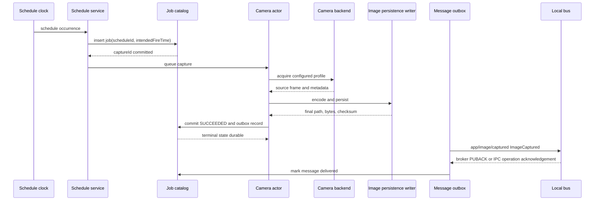

There is no originating request correlation because the origin is a schedule. The application message
receives a fresh correlation ID and includes `scheduleId`, `intendedFireTime`, and the actual acquisition
timestamps.

### 15.2 Terminal request/reply capture

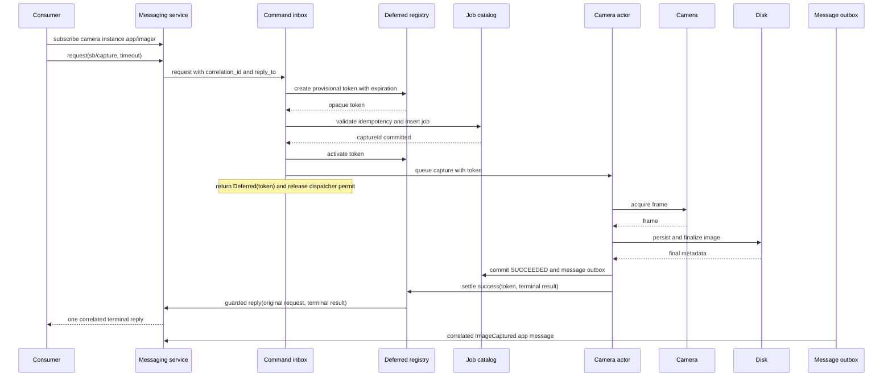

The reply and application message are two observations of one terminal result. Only the reply is a
response to the request. The application message is published for passive consumers and remains
retriable through the outbox.

### 15.3 Asynchronous submitted capture

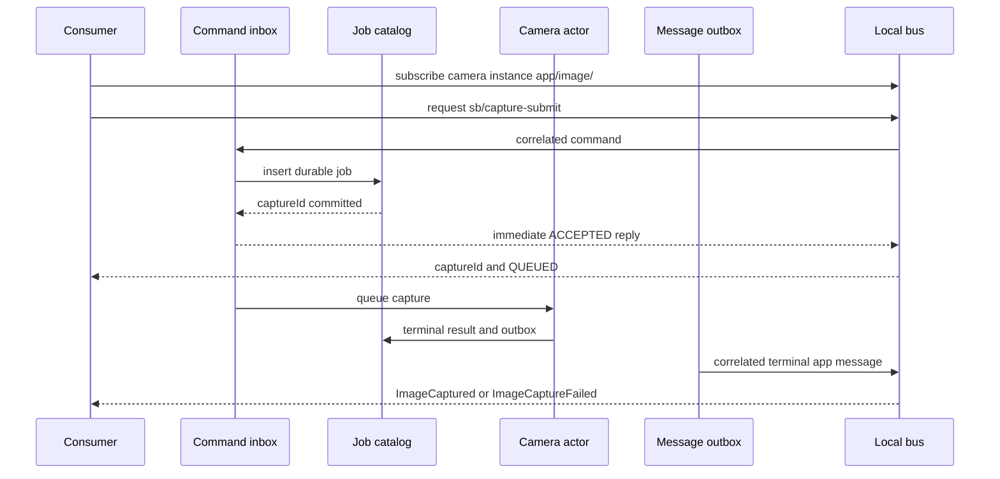

A consumer that cannot keep an application-message subscription uses `sb/capture-status` with the returned
`captureId`.

### 15.4 Consumer timeout and recovery

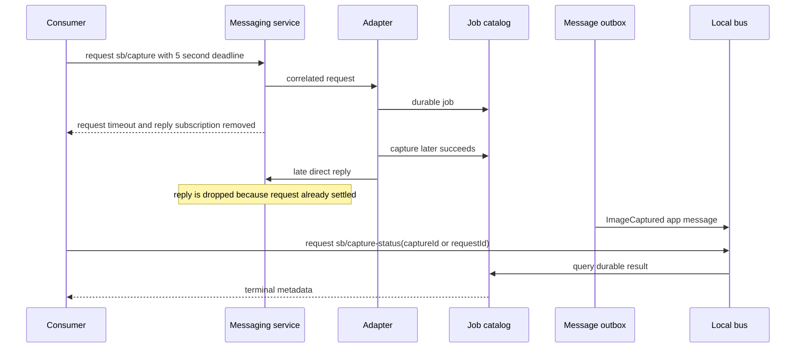

If the original consumer timed out before learning `captureId`, it may query by the supplied `requestId`
and camera instance. `requestId` is required for command-originated capture precisely to make this
recovery deterministic.

### 15.5 PTZ continuous move

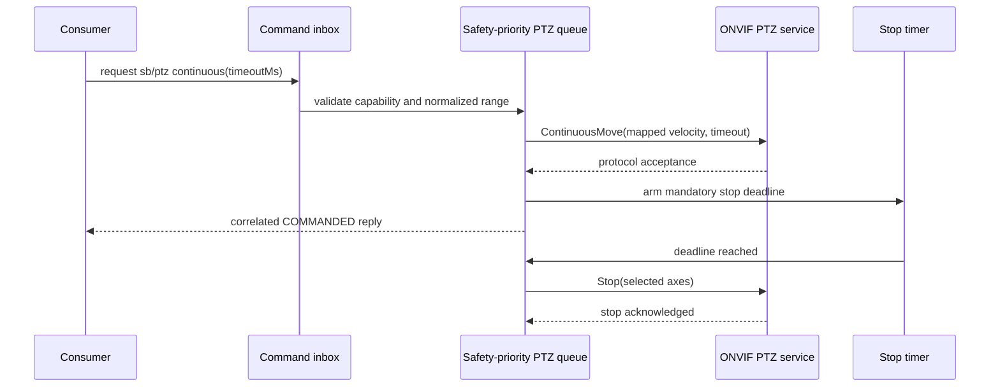

### 15.6 Disconnect and reconnect

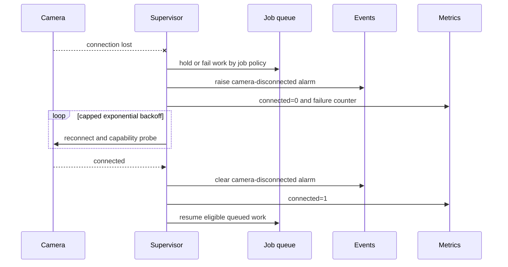

## 16. Concurrency, capacity, and backpressure

### 16.1 Capacity target

One process targets:

- 256 configured and connected idle camera sessions;
- 32 concurrent acquisitions when resource and byte limits permit;
- at least 1,024 configured entries without an internal fixed-size limit, though operational support is
  validated and published separately;
- command `ping`, `sb/status`, and PTZ-stop p95 processing latency below 250 ms while capture workers are
  saturated, excluding broker transport time;
- memory bounded by `maxInFlightBytes` plus connection/session overhead rather than total camera payload
  capacity.

These are release acceptance targets, not claims that every NIC, USB topology, camera, or disk can sustain
32 simultaneous full-resolution frames. The deployment must size resource groups to physical capacity.

### 16.2 Admission layers

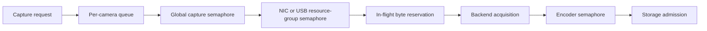

Unknown payload sizes reserve the camera's configured maximum frame size. Reservations are corrected when
the actual payload is known but never overcommitted.

### 16.3 Queue policies

- Each camera has independent capture and PTZ queues.
- Capture queue capacity defaults to four.
- Commands return `QUEUE_FULL` rather than blocking the messaging dispatcher.
- Scheduled jobs apply their `overlapPolicy` and may emit `schedule-skipped` instead of filling a queue.
- A camera offline at job time follows profile policy: `failFast`, `waitUntilDeadline`, or `queue` with a
  bounded expiration. Default for direct capture is `waitUntilDeadline`; default for schedules is
  `failFast` with a `schedule-skipped` event.
- Per-resource-group limits protect a shared GigE NIC, USB controller, decoder pool, or slow filesystem.

## 17. Reliability and recovery

### 17.1 Durable job catalog

SQLite runs in WAL mode when supported. The catalog stores jobs, request-id hashes, schedule occurrence
keys, effective profiles, paths, terminal results, deferred waiter metadata, and the message outbox. Image
bytes are never stored in SQLite.

Terminal jobs and their idempotency mappings share `resultRetentionHours` and `maxResultRecords`; an
idempotency key is never removed earlier than the status record it resolves. Count-based pruning removes
only the oldest terminal records and never removes a non-terminal job or undelivered outbox message.

The runtime owns an hourly retention sweep on its cancellable task set. Each sweep reclaims delivered
outbox messages past `outboxRetentionHours`, then terminal jobs, terminal groups, and completed command
ledgers past `resultRetentionHours`, then enforces `maxResultRecords`. Delivered messages are reclaimed
first because a terminal job or group is eligible only once its own retained messages are gone. The
sweep is issued in bounded batches with a pause between them, so a large backlog never saturates the
two-worker catalog pool that also carries the capture path, and it logs the counts it reclaimed.

At startup:

1. Validate and open the catalog before accepting commands.
2. Mark `ACCEPTED` jobs `INTERRUPTED` and insert `ImageCaptureFailed(PROCESS_INTERRUPTED)` in the same
   transaction because acceptance never completed its durable queue transition.
3. For `QUEUED` jobs, requeue only when `queuedRecoveryPolicy = requeue`, the queue deadline has not
   expired, and the snapshotted camera/profile can still run. Every other queued job is transactionally
   marked `INTERRUPTED` with an `ImageCaptureFailed(PROCESS_INTERRUPTED)` outbox message.
4. Mark `ACQUIRING` and `ENCODING` jobs `INTERRUPTED` and insert their failure outbox messages; those
   operations cannot resume safely.
5. Reconcile `PERSISTING` jobs with partial and final paths; complete success when the final artifacts
   verify, otherwise record terminal failure and its outbox message.
6. Resume outbox publication.
7. Start camera supervisors and schedules.

### 17.2 Message outbox

The same transaction that records a terminal result inserts its exact terminal application message,
including stable envelope UUID. Publication is retried with backoff. Successful publication records
delivery time. Retention removes old delivered messages but
never an undelivered terminal message without raising an operator-visible alarm.

### 17.3 Error isolation

- A camera panic or native callback failure is caught at the supervisor boundary and does not stop other
  cameras.
- Repeated native backend crashes MAY trip a per-camera circuit breaker.
- A process-wide native library crash cannot be contained in-process; hardware validation and optional
  process sharding are the mitigation.
- Invalid frames, incomplete buffers, authentication failures, protocol errors, conversion failures, and
  storage failures retain distinct categories in status and metrics.

### 17.4 Exactly-once claims

The design does not claim exactly-once terminal-message delivery. It provides:

- one durable capture job per idempotency key;
- at most one final file path per capture job;
- exactly one terminal state in the catalog;
- at-least-once terminal application-message publication;
- at-most-one direct reply per deferred waiter;
- consumer deduplication by `captureId`.

## 18. Security

### 18.1 Credentials and transport

- ONVIF/HTTP/RTSP credentials are configured as standard `$secret` references and resolve lazily
  through the EdgeCommons credentials vault; no bespoke reference mechanism is introduced.
- Plaintext credentials MUST NOT appear in component config, effective-config messages, logs, metrics,
  command results, or status.
- HTTPS and RTSPS SHOULD be used when the camera supports them. Certificate verification is on by default.
- Digest authentication is preferred over Basic when both are offered; Basic is allowed only over TLS
  unless an explicit development-only override is set.
- GenICam network interfaces SHOULD be isolated on dedicated camera VLANs.

### 18.2 Command authorization

Broker and Greengrass access control are the durable boundary. Component-side identity fields are useful
for audit but are not treated as unforgeable authorization. PTZ is disabled by default per camera and
preset mutation requires a second explicit configuration flag.

Greengrass recipes and MQTT ACLs grant only:

- subscribe to the component's `cmd/#` inbox and library broadcast verbs;
- publish replies to guarded `reply_to` topics;
- publish this component's event/app classes and library-owned metrics/state/config through the library;
- no wildcard actuation of other components.

### 18.3 Path and file safety

- Templates render only beneath the configured canonical output root.
- Linux rejects symlink and junction traversal for newly created path components unless an explicit trusted
  deployment policy allows it. Windows relies on deployment-controlled output roots and portable path
  validation; it does not claim hostile-local-actor junction/rename containment.
- Linux final files are created without overwrite. Windows uses standard-library no-overwrite link/install;
  a collision, unsupported hard-link filesystem, or finalization failure is `PERSISTENCE_FAILED`.
- Filename variables are sanitized and length-limited.
- Absolute paths are intentionally published locally but may expose host layout if messages are bridged.

### 18.4 Network request safety

- Camera-returned snapshot and stream URIs are restricted to the configured camera host or explicit
  allowlist.
- Redirects are disabled by default and never cross the allowlist.
- Link-local cloud metadata, loopback, and unrelated private addresses are rejected unless they are the
  explicitly configured camera endpoint.
- Discovery responses do not cause automatic credential use or connection.
- Response size, header size, XML depth, image size, and decompression ratio are bounded.

## 19. Observability and health

### 19.1 Standard southbound health

The adapter emits the standard `southbound_health` metric dimensioned by `instance` with the current
contract measures:

- `connectionState`: 1 when the camera session is online, otherwise 0;
- `publishLatencyMs`: terminal application-message publication latency;
- `pollLatencyMs`: the most recent capture/status acquisition round-trip where available;
- `readErrors`: acquisition/status read errors in the interval;
- `staleSignals`: 1 when the camera has no successful health/capture observation within the configured
  stale threshold, otherwise 0.

The optional standard `reconnects` measure is also emitted. Additional capture, queue, storage, PTZ, and
outbox measures below are camera-specific metrics; they do not redefine `southbound_health`.

### 19.2 Camera metrics

| Metric group | Bounded dimensions | Measures |
|---|---|---|
| `CameraConnection` | instance, backend, state | connected, connectAttempts, connectFailures, reconnects, capabilityChanges |
| `CameraCapture` | instance, backend, result, captureMode | captures, failures, durationMs, bytes, incompleteFrames, timeouts |
| `CameraQueue` | instance, trigger | depth, oldestAgeMs, rejected, skipped, active |
| `CameraEncoding` | encoding, result | frames, durationMs, inputBytes, outputBytes |
| `CameraStorage` | result | writes, writeDurationMs, bytes, freeBytes, verificationFailures |
| `CameraPtz` | instance, operation, result | commands, failures, durationMs, forcedStops |
| `CameraOutbox` | result | published, retries, pending, oldestAgeMs |

Paths, filenames, endpoint URLs, serial numbers, request IDs, capture IDs, and raw error strings are not
metric dimensions.

### 19.3 Logs

Logs include `instance`, `captureId`, backend, job stage, correlation ID when present, and a stable error
code. They redact credentials, query strings containing tokens, and camera-returned URIs that embed user
information. Repeating connection errors are rate-limited with periodic summaries.

### 19.4 Health endpoints

- Liveness means the process and runtime supervisors are making progress.
- Readiness means the command plane, catalog, and output root are usable and at least one enabled camera
  instance was accepted. It does not require every camera to be online.
- Startup remains false until config validation, catalog recovery, output validation, command registration,
  and camera supervisor creation finish.

## 20. Configuration reload and shutdown

### 20.1 Reload

The candidate configuration is parsed and validated before any live change. Each accepted job retains an
immutable effective profile.

- Schedule-only changes take effect for future occurrences.
- Output-template changes affect only newly accepted jobs.
- Capture-profile changes affect only new jobs.
- Connection or backend changes place the camera in `DRAINING`, stop new admission, finish or cancel the
  active job according to `reloadDrainTimeoutMs`, close the old session, and start the new session.
- Removing a camera follows the same drain path and leaves retained job results queryable until expiry.
- A failed replacement leaves the previous valid configuration running.

### 20.2 Shutdown

1. Stop schedule admission and reject new commands with `COMPONENT_STOPPING`.
2. Send safety `stop` to cameras with active continuous PTZ motion.
3. Wait for in-flight capture and persistence up to the configured grace period.
4. Mark remaining non-terminal jobs `INTERRUPTED` and settle deferred waiters where transport remains.
5. Flush the message outbox as time allows without delaying beyond the grace period.
6. Close backend sessions, catalog, metrics, and messaging subscriptions.
7. Let EdgeCommons publish its best-effort `STOPPED` state.

## 21. Deployment design

### 21.1 Platform-independent flow

The adapter uses the standard CLI:

```text
-c/--config FILE|ENV|GG_CONFIG|SHADOW|CONFIG_COMPONENT|CONFIGMAP
--platform HOST|GREENGRASS|KUBERNETES|auto
--transport MQTT [path]|IPC
-t/--thing <name>
```

Business logic has no platform branches. Packaging and device access differ by deployment.

### 21.2 Deployment topology

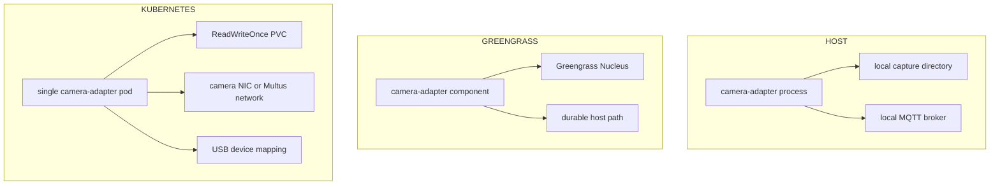

### 21.3 HOST

- Tier-1 target is Linux x86_64 and aarch64 with packaged Aravis/GLib and optional GStreamer libraries.
- ONVIF snapshot capture can be supported on Windows HOST without Aravis; Windows GenICam and GStreamer
  packaging require a phase-0 proof before being claimed as release support.
- Output and state directories must be durable and writable by the service account.
- GigE deployments document NIC selection, MTU, receive buffers, packet size, packet delay, and optional
  packet-socket capabilities. Elevated network capability is never required by default.

### 21.4 GREENGRASS

- Greengrass artifacts package architecture-matched native libraries or install them through an explicit,
  repeatable component dependency.
- The recipe grants only necessary IPC pub/sub access and vault/TES access when credentials require it.
- Output must use an explicit durable host path; the transient work directory is not a safe capture root.
- The component runs as a non-root user with filesystem, camera NIC, and USB permissions provisioned by
  the device owner.
- Linux-only Rust Greengrass features build and test under WSL/Linux before deployment to `lab-5950x`.

### 21.5 KUBERNETES

- Deploy exactly one active replica per camera set. Multi-active control is outside v1.
- Use a `ReadWriteOnce` PVC for output and durable state unless a proven shared filesystem is required.
- Bind the pod to a camera-connected node with node selectors/affinity.
- USB3 Vision needs a device plugin or explicit device mapping and stable permissions.
- GigE Vision commonly needs `hostNetwork`, Multus, or a dedicated secondary interface so discovery and
  UDP receive traffic reach the camera VLAN.
- Configure termination grace long enough for final image persistence and PTZ stop.
- Prometheus, JSON stdout logging, and health probes use the current Kubernetes EdgeCommons facilities.

### 21.6 Sharding

When one host's NIC, USB topology, native SDK, or memory cannot meet the fleet target, deploy multiple
adapter processes with disjoint camera sets and distinct EdgeCommons device identities. The same camera
MUST NOT be controlled by two active adapter processes.

## 22. Intended usage patterns

### 22.1 Command-only inspection camera

Configure a GenICam camera with no schedules. A PLC-facing or inspection application sends
`sb/capture` with an idempotent `requestId`, waits for a terminal reply, then opens `absolutePath` on the
shared edge filesystem. It verifies `sha256` when handing the file to another process.

### 22.2 Scheduled camera fleet

Configure each camera as an instance with one or more schedules. Cameras sharing a NIC use the same
resource group. Schedules that need approximate cadence use jitter to avoid a top-of-hour burst; schedules
that need the same intended time keep zero jitter and rely on admission limits.

### 22.3 Asynchronous production workflow

A workflow engine subscribes to `app/image/#`, then calls
`sb/capture-submit`. It records `captureId` from the acceptance reply and joins the eventual terminal
application message by `captureId`. Correlation ID remains useful diagnostics for the creating request
but is not required to match a retry. If the message subscription drops, it recovers with
`sb/capture-status`.

### 22.4 ONVIF PTZ camera

An operator moves a camera with bounded `sb/ptz` commands, recalls a configured preset, and then issues
`sb/capture`. The capture profile uses `snapshot-uri` for efficient JPEG acquisition or `rtsp-frame` when
fresh stream sampling is required.

### 22.5 Multi-camera evidence set

A line-clearance or batch-inspection application calls `sb/capture-group` with the cameras covering the
line and one idempotent `requestId`. It receives a single aggregated terminal reply, stores the member
images keyed by `captureGroupId`, and applies its own evidence policy to a `PARTIAL` group. Passive
consumers subscribe to `app/image/#` and group the terminal messages on `captureGroupId`. The group
claims no physical synchronization; a deployment that needs bounded skew sizes admission capacity so
members acquire promptly.

### 22.6 File-replicator integration

`file-replicator` watches the camera output root or selected camera subdirectories. It replicates only
final extensions and ignores `.partial` files and the adapter state directory. The camera adapter does not
wait for remote delivery and does not delete a file after replication.

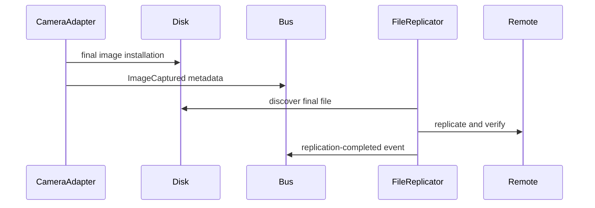

### 22.7 Consumer rules

A correct consumer:

- treats `captureId` as the durable primary key;
- treats correlation ID as a conversation join key;
- tolerates duplicate terminal application messages;
- never assumes an absolute path is mounted on a remote host;
- verifies that the file exists before opening it and optionally verifies checksum;
- uses status recovery after timeout or terminal-message loss;
- does not infer physical PTZ completion from a `COMMANDED` result.

## 23. Testing and validation strategy

Testing is layered. Simulators provide deterministic breadth; physical cameras prove interoperability and
timing. Neither substitutes for the other.

### 23.1 Unit and property tests

- Configuration defaults, invalid combinations, redaction, per-backend parsing, and reload diffing.
- Path rendering, Windows/POSIX absolute paths, sanitization, traversal, Linux symlink/junction rejection,
  collision resistance, and maximum lengths.
- Cron time zones, DST transitions, misfires, overlap, jitter, and deterministic schedule deduplication.
- Job state transitions, cancellation races, restart reconciliation, catalog transactions, retention,
  message outbox, and idempotency conflicts.
- Admission fairness, byte reservations, queue bounds, priority aging, and resource groups.
- Deferred reply settle-once races, late reply, requester timeout, multiple waiters, and shutdown.
- Group capture: all-or-nothing validation, aggregated-reply assembly, partial completion, group
  cancellation, group status/recovery by `requestId`, and component-scoped group idempotency.
- Correlated application-message header propagation and fresh scheduled-message correlation.
- PTZ normalized-to-native coordinate mapping and mandatory continuous-stop timers.
- Image encoders and decoders against golden pixel fixtures and checksums.
- ONVIF XML limits, URI allowlisting, redirects, authentication, and malformed responses.
- Property/fuzz tests for message bodies, image headers, GenICam metadata, XML, and path templates.

The Rust component enforces at least 90% line coverage for CI-testable code and runs `cargo test`,
`cargo clippy --all-targets --all-features -- -D warnings`, formatting, dependency audit, and native-feature
build checks.

### 23.2 Required simulator suite

| Simulator | Purpose | Required scenarios | Limitation |
|---|---|---|---|
| In-process `SimBackend` | Fast deterministic camera fleet | 1–1,024 cameras, delays, disconnects, bad frames, PTZ ranges, cancellation, memory pressure | Does not validate a protocol stack. |
| Aravis fake GigE Vision camera (`arv-fake-gv-camera`, sometimes version-suffixed by distribution) | Real Aravis discovery and acquisition path | Software trigger, payload size, incomplete/timeout injection where supported, reconnect | Primarily GigE Vision; not a USB3 Vision substitute. |
| GStreamer `videotestsrc` with `gst-rtsp-server`, or a pinned MediaMTX test service fed by generated video | RTSP negotiation and frame extraction | H.264/H.265 where licensed/available, reconnect, codec change, slow first frame, invalid stream | Does not provide ONVIF control. |
| In-repository ONVIF device simulator | Deterministic SOAP, auth, capability, snapshot, and PTZ behavior | GetCapabilities, media profiles, GetSnapshotUri, Digest auth, PTZ operations/presets, faults, hostile URI/redirect | Must be maintained with the component contract. |
| In-repository WS-Discovery UDP responder | ONVIF multicast discovery | Probe/resolve, duplicate devices, malformed XAddr, timeout, multiple interfaces | Does not prove real camera or container L2 behavior. |
| Snapshot HTTP fixture service | Snapshot transfer hardening | Dynamic JPEG, auth challenges, delay, truncation, oversize, redirect, wrong content type | Does not model camera exposure timing. |
| Combined ONVIF simulator plus RTSP server | End-to-end ONVIF/RTSP fallback | Snapshot unsupported, snapshot fetch failure, RTSP fallback, profile selection, PTZ while capturing | Still not proof against vendor quirks. |
| Vendor SDK virtual camera or GenTL producer, selected for each supported vendor family | Vendor compatibility before hardware arrives | Feature-node differences, pixel formats, buffer behavior | Availability and license vary; pin exact versions in CI/lab docs. |

Recommended network fault tools:

- Linux `tc netem` for GigE Vision UDP loss, delay, reorder, rate, and burst behavior.
- Toxiproxy or an equivalent TCP proxy for ONVIF HTTP/HTTPS and RTSP control-path latency, disconnect,
  timeout, and half-open behavior.
- A test DNS/HTTP service for hostname changes, expired credentials, certificate errors, and safe redirect
  rejection.

Recommended storage fault tools:

- injected writer failures for deterministic unit tests;
- temporary filesystems and restrictive permissions;
- a bounded loopback filesystem to exercise low-space and ENOSPC paths on Linux;
- process termination at every persistence checkpoint to verify restart reconciliation.

The in-repository ONVIF simulator is preferred over depending solely on a third-party simulator because it
must expose deterministic PTZ position, move state, preset state, authentication challenges, snapshot
bytes, RTSP URIs, and specific fault sequences. Third-party and vendor simulators remain valuable
compatibility layers.

### 23.3 Messaging validation

For the component:

- Run HOST mode against real EMQX and verify every command success/error shape, terminal `app` topic/body,
  operator `evt` topic/body, correlation ID, identity instance, duplicate-message handling, status
  recovery, and late reply behavior.
- Use at least one independent consumer implementation, preferably the EdgeCommons Python library, to
  prove the Rust component contract is not self-consistent only.
- Verify terminal application messages are published locally by default and survive a broker outage
  through the outbox with the same envelope UUID on retry.
- Verify shutdown unsubscribes cleanly and does not leak request subscriptions.
- Verify rooted and rootless exact topics, protobuf wire encoding, and per-camera identity stamping.
- Verify UNS-bridge behavior with `app` uplink disabled and enabled, and terminal request/reply both before
  and after bridge reply-map TTL expiry.

For the required core deferred-reply, correlated-`app()`, and acknowledged-publish additions:

- Extend shared vectors where applicable.
- Run Java, Python, Rust, and TypeScript as both requester and deferred responder over local MQTT.
- Assert exact correlation IDs, one reply, timeout cleanup, late-reply drop, and application-message
  header propagation.
- Assert MQTT QoS 1 delivery is not confirmed before PUBACK, disconnect-before-PUBACK remains pending,
  ambiguous timeout retries the same UUID, and Greengrass IPC operation completion is observed.
- Deploy all four interop nodes on `lab-5950x` and repeat over real Greengrass IPC.

### 23.4 Backend integration validation

GenICam/Aravis:

- Run the Aravis fake camera in CI or an integration job.
- Validate discovery and explicit selector binding.
- Capture every initially supported pixel format and output encoding.
- Inject packet loss and incomplete buffers; assert no corrupted success files.
- Exercise reconnect while other simulated cameras continue capturing.

ONVIF/RTSP:

- Run the in-repo ONVIF simulator and RTSP simulator together.
- Validate Digest and TLS authentication, media profile selection, snapshot capture, RTSP frame mode,
  fallback policy, URI allowlisting, and PTZ operations.
- Confirm a continuous move is stopped by timeout even if the requester disappears.
- Confirm an ONVIF snapshot reports fetch/acquisition timing without claiming hardware trigger timing.

### 23.5 Scale and soak tests

The current capacity-validation slice is a short, repeatable Linux simulator proof of 1,024 configured
entries, 256 connected idle sessions, and 32 concurrent 8-megapixel captures with resource and process
samples. A separately recorded, 15-minute partial simulator smoke follows that proof with schedules,
commands, PTZ/status, reconnects, and valid reloads using small frames. Neither is a long-duration
performance result or a replacement for the deferred soak below.

The following full-soak scenario remains part of the design, but its 24-hour execution is explicitly
deferred to a later validation phase and is not a current gate:

- 256 simulated connected cameras for 24 hours with schedules, command bursts, reconnects, and PTZ traffic.
- 32 concurrent 8-megapixel captures with `maxInFlightBytes` enforcement and no unbounded RSS growth.
- 10,000 mixed submitted jobs with retries and idempotent duplicates.
- Broker outage during 1,000 terminal captures, followed by outbox drain with no missing capture IDs.
- Repeated config reloads while cameras connect, capture, and drain.
- Forced process termination at acquisition, encoding, persistence, DB commit, reply, and terminal-message publication.
- Seven-day schedule/DST simulation with an injected clock; no wall-clock waiting in CI.

Record CPU, RSS, native thread count, open descriptors, buffer counts, NIC loss, disk latency, command
latency, queue depth, and outbox age. Release thresholds are established in the phase-0 spike and kept in a
versioned benchmark baseline.

### 23.6 Physical camera compatibility matrix

**Project validation decision — 2026-07-12.** The project owner has waived physical-camera tests because
no camera hardware is available. This removes the following matrix from this project's completion gates,
but does not permit any claim of compatibility with a camera model, firmware, NIC, USB topology, encoder,
optics, exposure behavior, sensor noise, lens distortion, or device timing. The compatibility register
must record the waiver and preserve the excluded claims. A future hardware-certified release must restore
and complete this matrix.

For a hardware-certified release, validate at least:

- two GigE Vision models from different vendors;
- two USB3 Vision models from different vendors;
- two ONVIF Profile S/T camera families from different vendors;
- one ONVIF PTZ camera with absolute, relative, continuous, stop, home, status, and presets where supported;
- one camera using HTTPS/Digest authentication;
- one ONVIF camera without usable snapshot support to force RTSP capture;
- Mono8, RGB/BGR, one Bayer format after demosaicing lands, JPEG passthrough, and one high-resolution frame;
- simultaneous capture on a representative NIC and USB topology.

For each model, record firmware, protocol/profile version, working selector, capabilities, formats,
known quirks, required network settings, and pass/fail evidence. Simulator green does not establish this
matrix.

### 23.7 Platform validation matrix

| Path | Required validation |
|---|---|
| HOST/Linux | EMQX, all simulators, native Aravis/GStreamer build, local disk, and the current short capacity proof. The 24-hour soak execution is deferred to a later validation phase. |
| HOST/Windows | ONVIF snapshot and messaging first; Aravis/GStreamer only after the packaging spike proves them. |
| Rust Greengrass feature | WSL/Linux build and tests. |
| GREENGRASS | Deploy to `lab-5950x`; exercise commands, `app`, and `evt` over IPC and at least a reachable simulator or physical network camera. |
| KUBERNETES/kind | ConfigMap reload, PVC, probes, Prometheus, shutdown, simulated ONVIF/RTSP. |
| Kubernetes hardware runner or lab k3s | Camera NIC/USB device access and real-camera capture. |
| Full system | Add simulated cameras to `bottling-company-test`; verify console command/message visibility and optional file replication. |

### 23.8 Acceptance evidence

A phase is not complete based only on unit tests. The review record must include:

- commands run and versions of camera/native dependencies;
- test and coverage results;
- simulator configurations;
- sample request, reply, terminal-application, and operator-event envelopes;
- image checksum and file metadata evidence;
- the recorded physical-camera waiver and excluded compatibility claims, or model/firmware results for a
  hardware-certified release;
- resource graphs for scale tests;
- Greengrass and Kubernetes deployment evidence;
- explicit gaps when a required lab path could not run.

## 24. Implementation plan

| Phase | Scope | Exit criteria |
|---|---|---|
| P0 — dependency and capacity spike | Rust skeleton; Aravis and GStreamer packaging; ONVIF client approach; SimBackend; SQLite; Windows feasibility; baseline memory/threads | Native stacks capture one frame; SimBackend proves 256 sessions; dependencies and supported OS matrix approved. |
| P1 — core messaging plumbing | Four-language deferred commands, correlated application messages, and acknowledgement-capable publish | Unit coverage, local 4×4 MQTT interop including PUBACK behavior, deployed 4-language Greengrass IPC interop; four-language skeletons and CLI component templates updated, compiled, and scaffold→build regression-tested against the new APIs; core docs-site developer guide and per-subsystem reference pages updated. |
| P2 — common engine | Config, catalog/outbox, admission, schedules, storage, command/message surface, SimBackend | Complete contract green against simulator and EMQX; crash checkpoints and 90% coverage. |
| P3 — ONVIF snapshot and PTZ | ONVIF discovery/services/auth, snapshot capture, PTZ/presets, simulator | Full ONVIF simulator suite and security tests; physical ONVIF/PTZ compatibility is explicitly waived for this project. |
| P4 — GenICam/Aravis | GigE Vision and USB3 Vision, feature profiles, buffer acquisition, formats | Aravis simulator and packet-fault tests; vendor hardware compatibility is explicitly waived for this project. |
| P5 — RTSP capture | GStreamer frame extraction and ONVIF fallback | RTSP simulator and codec/fault suite; physical fallback-camera compatibility is explicitly waived for this project. |
| P6 — deployments and system validation | Greengrass, Kubernetes, file-replicator and bottling-company integration, scale/soak | All current platform gates, short capacity evidence, docs and registry ready. The 24-hour fleet-soak execution is deferred to a later validation phase. |
| P7 — general release | Compatibility register, security review, operational docs, registry status change | No unresolved blocking findings; release checklist signed off. |

Implementation remains local until the user explicitly authorizes push, pull request, or merge.

## 25. Documentation deliverables

Implementation must add the normal Diátaxis set:

- `docs/tutorial.md`: first simulated capture, then first physical camera;
- `docs/how-to-guides.md`: schedules, PTZ, ONVIF auth, GenICam tuning, RTSP fallback, file-replicator;
- `docs/sample-configurations.md`: command-only, scheduled fleet, GigE, USB3, ONVIF snapshot, RTSP, PTZ;
- `docs/explanation.md`: job lifecycle, capture timing, correlation, backpressure, and backend differences;
- `docs/reference/configuration.md`: canonical fields/defaults;
- `docs/reference/messaging-interface.md`: all commands/events and schemas;
- `docs/reference/compatibility.md`: tested camera models, firmware, simulators, and quirks;
- `docs/reference/metrics.md`: measures, dimensions, units, and alerts;
- deployment runbooks for HOST, Greengrass, and Kubernetes;
- core docs-site updates for the P1 additions: the commands developer guide and the messaging and
  application-message reference pages gain the deferred handler outcome, correlated `app()`, and
  acknowledgement-capable publish, synchronized across all four language tabs.

Reference documentation describes current implemented behavior only. This design remains the approved
future contract until implementation catches up; it must not be copied into reference pages as if shipped.

## 26. Review checklist

Reviewers should explicitly decide:

- [ ] Rust and the proposed native dependency boundary are acceptable.
- [ ] One component with `genicam-aravis` and `onvif-rtsp` backends is the right product boundary.
- [ ] One camera per EdgeCommons instance is correct.
- [ ] The 256-connected / 32-concurrent capacity target is appropriate.
- [ ] SQLite durable job state and a message outbox are warranted.
- [ ] The output root and default per-camera subdirectory layout are correct.
- [ ] Absolute path, relative path, file URI, checksum, and metadata are sufficient for consumers.
- [ ] Deferred `sb/capture` and immediate `sb/capture-submit` are both required.
- [ ] Software-level group capture (`sb/capture-group`) scope, aggregated-reply semantics, and its
  explicit no-synchronization claim are correct.
- [ ] Keeping the shipped `main`-inbox command addressing — and thereby superseding the approved
  Phase 5 per-instance `cmd/sb/*` target in `core/docs/SOUTHBOUND.md` — is accepted (see §27).
- [ ] Four-language deferred-command, correlated-`app()`, and acknowledgement-capable-publish core
  additions are accepted plumbing.
- [ ] Command names, bodies, error codes, and PTZ normalized coordinates are acceptable.
- [ ] Event types and at-least-once semantics are sufficient.
- [ ] ONVIF snapshot timing semantics and RTSP fallback are described truthfully.
- [ ] Storage, URI, credential, and PTZ security controls are adequate.
- [ ] Simulator, waived-physical, Greengrass, Kubernetes, scale, and soak gates are sufficient.
- [ ] Tier-1 Linux and conditional Windows support are acceptable for v1.
- [ ] Phase ordering is acceptable.

## 27. Open questions for review

1. Should the supported connected-camera target be 256, or should the first release target a smaller
   certified number while retaining the architecture's configurable limits?
2. Should metadata sidecars remain opt-in, or should they be mandatory so an image remains self-describing
   when separated from the catalog and bus message?
3. Should `raw` be a v1 output, or wait until a standard sidecar schema is approved?
4. Which Bayer/PFNC formats and demosaicing algorithms are required for the first GenICam release?
5. Is Linux-only Tier-1 support acceptable for GenICam v1, with Windows HOST support staged after the
   native packaging spike?
6. Should PTZ preset mutation stay disabled by default as proposed?
7. Physical-camera validation is waived for this project because no hardware is available; a future
   hardware-certified release must select models for the compatibility matrix.
8. Command addressing: should the org retire the approved-but-unshipped Phase 5 per-instance
   `cmd/sb/*` addressing (`core/docs/SOUTHBOUND.md` §2.2) in favor of the shipped
   `main`-inbox-plus-body-`instance` pattern this design uses, or must this adapter adopt per-instance
   addressing when Phase 5 ships? Either decision updates `core/docs/SOUTHBOUND.md`.
9. Should the core add a scatter-gather message exchange pattern — one request producing multiple
   correlated replies or a streamed reply set? v1 group capture deliberately aggregates member results
   into one reply within the existing single-reply command model. A core pattern would also serve other
   fan-out surfaces (multi-instance adapters, edge-console bulk commands) and, if wanted, should be
   designed in core with four-language parity rather than per component.
10. Should the P2 common engine (config, catalog/outbox, admission, scheduling, image persistence writer, command
    surface) be extracted into the planned reusable Rust protocol-adapter CLI template, and in which
    phase does that extraction land?

## 28. Source-of-truth references

This design is grounded in the current EdgeCommons contracts:

- `core/docs/SOUTHBOUND.md` for adapter configuration, command-family, and health conventions; its §2.2
  per-instance command addressing is approved-but-unshipped Phase 5 design that §12.1 of this document
  proposes to supersede (§27 question 8);
- `core/docs/platform/UNS-CANONICAL-DESIGN.md` for topic, identity, request/reply, guard, and timeout rules;
- `file-replicator/docs/reference/messaging-interface.md` for current command/event usage and durable-file
  integration precedent;
- `opcua-adapter/docs/reference/messaging-interface.md` for the current multi-instance `sb/*` adapter
  pattern;
- the Rust EdgeCommons command, messaging, events, configuration, metrics, health, and template source.

If those contracts change before implementation, this document must be re-reviewed and updated rather
than silently implementing against stale assumptions.
